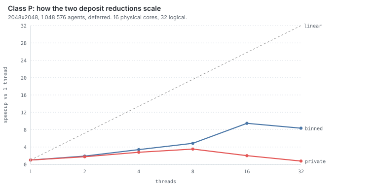

# Ergebnisse

Referenzmaschine: **AMD Ryzen 9 9950X3D** (16C/32T, Zen 5, 128 MB L3),
**NVIDIA RTX 5080** (84 SMs), Ubuntu 24.04 unter WSL2, gemessen vom
ext4-Dateisystem.
gcc 13.3 · clang 18.1 · rustc 1.97 · GHC 9.10.3 · Node 25.5 · Python 3.12 · Perl 5.38 · CUDA 12.0

Rohdaten in [`results/`](../results/), Diagramme aus `bench/charts.py`.
Alle Zeiten sind der beste Lauf von mehreren; wo die Streuung relevant ist,
steht sie dabei.

```bash
scripts/stage-wsl.sh bench --preset small --ticks 300 --reps 3
```

---

## Inhalt

1. [Die kurze Fassung](#1-die-kurze-fassung)
2. [Sprachvergleich (Klasse S)](#2-sprachvergleich-klasse-s)
3. [Compiler](#3-compiler)
4. [Wie sehr der Programmierstil zählt (Haskell)](#4-wie-sehr-der-programmierstil-zählt-haskell)
5. [Parallelität (Klasse P)](#5-parallelität-klasse-p)
6. [SIMD (Klasse V)](#6-simd-klasse-v)
7. [GPU (Klasse G)](#7-gpu-klasse-g)
8. [Rendering (Klasse R)](#8-rendering-klasse-r)
9. [Footprint](#9-footprint)
10. [Was nicht funktioniert hat](#10-was-nicht-funktioniert-hat)
11. [Wo ich mich geirrt habe](#11-wo-ich-mich-geirrt-habe)
12. [Offene Punkte](#12-offene-punkte)

---

## 1. Die kurze Fassung

Dieselbe Simulation, zehn Implementierungen, von einem Perl-Interpreter bis zu
84 Streaming-Multiprozessoren. Der Abstand zwischen dem langsamsten und dem
schnellsten Weg beträgt **Faktor 245 000**.


| Klasse | beste Konfiguration | `medium`, 100 Ticks | vs. 1 CPU-Kern |
|---|---|---:|---:|
| S — ein Thread | C, gcc `-O3 -march=native` | 4791–4978 ms | 1× |
| V — SIMD, 1 Thread | C, AVX-512 | 4376 ms | 1.1× |
| P — 16 Threads | C, pthreads, `binned` | 588–662 ms | **8×** |
| G — GPU | CUDA, RTX 5080 | **50 ms** | **99×** |

Wo zwei Zahlen stehen, stammen sie aus zwei Messreihen (`E-parallel-scaling`
und `H-gpu`) an verschiedenen Tagen. Die Spannweite ist die Lauf-zu-Lauf-Streuung
auf einer Maschine, auf der auch Windows läuft — Vergleiche werden deshalb
immer innerhalb einer Reihe gezogen, nie über Reihen hinweg.

Die vier Ergebnisse, die ich vorher nicht erwartet hätte:

- **Bit-Exaktheit reicht bis auf die GPU — und durch jede Parallelisierung.**
  CUDA liefert exakt dieselben Prüfsummen wie die C-Referenz, Grid *und*
  Agenten. Ebenso SIMD, ebenso Klasse P in **allen sieben Sprachen**, für jede
  Thread-Zahl. Und die fünf Ports mit `private`-Strategie liefern bei
  `--deposit 0.1` sogar denselben *falschen* Hash — dieselbe Klammerung,
  derselbe Fehler, fünf Sprachen.
- **Was schnell ist, hängt von der Klasse ab.** TypeScript ist in Klasse S
  dreimal langsamer als C und skaliert in Klasse P am besten von allen (11.2×).
  Haskell liegt in Klasse S bei 2.2× und trifft in Klasse P und in Klasse R
  jeweils C. Eine Sprachrangliste aus einer Klasse überträgt sich nicht auf die
  nächste.
- **Perl und reines Python liegen 0,9 % auseinander.** Zwei unabhängig
  entwickelte Interpreter, dieselbe Schleife, praktisch dieselbe Zeit.
- **Fast jede „offensichtliche" Optimierung hat verloren.** PGO, die parallele
  Präfixsumme, der Lastausgleich, die reine Spin-Barriere — vier Versuche, ein
  brauchbares Ergebnis. Details in §10.

---

## 2. Sprachvergleich (Klasse S)

Ein Thread, skalar, `--update serial`. 256×256 mit 16 384 Agenten und
100 Ticks — diese Größe ist so gewählt, dass **auch Perl und reines Python sie
in Sekunden schaffen**, denn nur so passen alle Sprachen in eine Tabelle.


| # | Sprache | Variante | Konf. | ms/Tick | rel. | RSS MiB |
|---|---|---|:-:|---:|---:|---:|
| 1 | C++ | g++ -O2 | A | 0.221 | 1.00× | 18 |
| 2 | C | clang -O2 | A | 0.228 | 1.03× | 18 |
| 3 | C++ | clang++ -O2 | A | 0.231 | 1.05× | 18 |
| 4 | C | gcc -O2 | A | 0.240 | 1.09× | 18 |
| 5 | Rust | unchecked | A | 0.253 | 1.15× | 18 |
| 6 | Rust | safe | A | 0.295 | 1.34× | 18 |
| 7 | Haskell | ghc -O2 ¹ | A | 0.478 | 2.16× | 18 |
| 8 | TypeScript | Node | A | 0.664 | 3.00× | 79 |
| 9 | Perl | | B | 37.19 | **168×** | 22 |
| 10 | Python | pur | B | 37.52 | **170×** | 18 |
| 11 | Python | `--strict-f32` | A | 85.72 | 388× | 18 |
| 12 | Perl | `--strict-f32` | A | 123.36 | 558× | 22 |

numpy fehlt hier, weil es `--update serial` prinzipiell nicht kann (§7). Im
`deferred`-Modus, wo alle Sprachen antreten können:

| Sprache | Konf. | ms/Tick | rel. |
|---|:-:|---:|---:|
| C++ g++ -O2 | A | 0.228 | 1.00× |
| C gcc -O2 | A | 0.258 | 1.13× |
| Rust unchecked | A | 0.258 | 1.13× |
| Haskell -O2 | A | 0.508 | 2.23× |
| TypeScript | A | 0.710 | 3.11× |
| **Python / numpy** | A | 0.717 | **3.14×** |

¹ vor der `unsafeAt`-Korrektur aus §4 gemessen; die macht Haskell dort um
Faktor 1.45 schneller. Diese Tabelle wird beim nächsten vollen Matrixlauf
ersetzt.

**Alle Stufe-A-Läufe liefern `0x9E8B1688 / 0x0E6A2341`.** Dieselbe Simulation,
sechs Sprachen, Bit für Bit.

Bemerkenswert:

- **Perl und reines Python auf 0,9 % genau** (37,19 vs. 37,52 ms/Tick). Der
  Interpreter-Dispatch dominiert so vollständig, dass der Sprachunterschied
  verschwindet.
- **TypeScript mit Faktor 3** ist die Überraschung. V8 liegt zwei
  Größenordnungen näher an C als an den anderen Skriptsprachen — und dabei in
  Konformitätsstufe A, weil `Math.fround` um jede Operation beweisbar dasselbe
  liefert wie f32-Arithmetik (`53 ≥ 2·24+2`).
- **numpy holt Python von 170 auf 3,1** und bleibt bit-exakt.
- **Rusts Bounds-Checks kosten 17 %** in dieser Zeile — aber die Aufschlüsselung
  in §3 zeigt, dass der Effekt vollständig aus dem Diffusionspass kommt.
- **RSS ist fast überall 18 MiB**, weil das Grid ihn dominiert und in jeder
  Sprache gleich groß ist. Auffällig sind nur die Laufzeitumgebungen: Node mit
  79 MiB, numpy mit 40.

### Was Bit-Exaktheit in den Skriptsprachen kostet

Python und Perl laufen per Default in Stufe B. `--strict-f32` rundet jede
Zwischenoperation über `struct`/`pack` auf f32 und ist nachweislich bit-exakt.

| Sprache | Stufe B | Stufe A | Aufschlag |
|---|---:|---:|---:|
| Python (pur) | 37.52 ms/Tick | 85.72 ms/Tick | 2.3× |
| Perl | 37.19 ms/Tick | 123.36 ms/Tick | 3.3× |

Deutlich billiger als erwartet, und das ist selbst der Befund: in einer
Sprache, die pro Operation ohnehin einen Interpreter-Dispatch zahlt,
verschwinden neun zusätzliche C-Level-Aufrufe pro Zelle weitgehend im schon
vorhandenen Overhead.

Perl zahlt mehr als Python, weil ein Perl-Array volle Doubles speichert und
damit *jede* Operation gerundet werden muss, während Pythons `array('f')` beim
Store ohnehin auf f32 rundet.

---

## 3. Compiler

1024×1024, 262 144 Agenten, 300 Ticks. Rot markiert sind die fast-math-Builds
(Konformitätsstufe C).


**28 von 28 Stufe-A-Läufen liefern `0x4F236CC6 / 0x4236A1D1`** — über zwei
Sprachen, zwei Compiler, sechs Optimierungsprofile und LTO hinweg. Die beiden
fast-math-Builds weichen ab, und zwar *pro Compiler unterschiedlich*.

### clang und gcc reagieren gegensätzlich auf `-march=native`

| | `-O2` | `-O3` | `-O3 -march=native` |
|---|---:|---:|---:|
| gcc | **1310** | 1317 | 1330 |
| clang | 1375 | 1380 | **1131** |

Bei gcc ist `-O2` das Optimum, alles darüber leicht schlechter. Bei clang
bringt `-march=native` **18 %** — und ohne es liegt clang hinter gcc. Wer nur
`-O2` vergleicht, schließt „gcc ist schneller"; wer `-march=native` dazunimmt,
das Gegenteil. Derselbe Quelltext.

### `-Ofast` verliert immer, aber aus zwei verschiedenen Gründen

Phasenzahlen, jeweils `-march=native`:

| | gesamt | Agenten-Pass | Diffusions-Pass |
|---|---:|---:|---:|
| clang `-O3` | 1131 | 838 | 292 |
| clang `-Ofast` | 1663 | 832 | **831** |
| gcc `-O3` | 1330 | 1037 | 293 |
| gcc `-Ofast` | 1352 | **1072** | 280 |

Bei **clang** kostet fast-math 47 %, vollständig im Diffusionspass (Faktor
2,85) — die Reassoziationsfreiheit lässt es den 9-Punkt-Stencil in etwas
Schlechteres umordnen. Bei **gcc** wird der Stencil minimal schneller und
dafür der Agenten-Pass langsamer. Netto 2 % Verlust.

Zwei Compiler, dasselbe Flag, gegenläufige Wirkung auf dieselben zwei
Schleifen. Man bezahlt Determinismus und bekommt nichts.

### Bounds-Checking kostet im Stencil, nicht im Agenten-Pass

| Rust-Profil | gesamt | Agenten-Pass | Diffusions-Pass |
|---|---:|---:|---:|
| `release` safe | 1715 | 1290 | 425 |
| `release` unchecked | 1642 | 1365 | **277** (−35 %) |
| `release+native` safe | 1729 | 1346 | 382 |
| `release+native` unchecked | 1510 | 1234 | **276** (−28 %) |

Der Diffusionspass verliert durch die Checks konsistent 28–35 % — sie stehen
der Vektorisierung im Weg. Im Agenten-Pass ist der Effekt **nicht robust**:
einmal langsamer, einmal schneller, beides in Größenordnung der
Codegen-Streuung. Ehrliche Aussage: dort kein messbarer Effekt, weil die CPU
ohnehin auf Cache-Misses wartet.

„Bounds-Checking kostet nichts" und das Gegenteil sind beide falsch — es hängt
am Zugriffsmuster, und dieser Benchmark hat zufällig beide Sorten in einem
Programm.

### GHC: das LLVM-Backend lohnt sich

`small`, 300 Ticks, bester von drei Läufen
([`results/J-ghc-llvm.jsonl`](../results/J-ghc-llvm.jsonl)):

| Profil | ms | rel. | Binär KiB |
|---|---:|---:|---:|
| `-O1` | 4318 | 1.55× | 3090 |
| `-O2` | 2790 | 1.00× | 3094 |
| `-O2 -fllvm` | **2131** | **0.76×** | 3168 |

Das LLVM-Backend bringt **24 %** gegenüber dem nativen Codegenerator, für 2 %
mehr Binärgröße. (Gemessen vor der `unsafeAt`-Korrektur aus §4; die wirkt auf
alle drei Profile gleichermaßen und verschiebt das Verhältnis nicht.) Alle drei bit-exakt (`0x4F236CC6 / 0x4236A1D1`). GHC 9.10
warnt, dass LLVM 18 außerhalb des unterstützten Bereichs liegt, und macht
trotzdem korrekt weiter — geprüft gegen die Konformitätsvektoren, nicht
geglaubt.

> In der Compiler-Matrix oben schlägt `o2-llvm` noch fehl, weil `opt`/`llc`
> nicht im `PATH` lagen. `impl/haskell/build.sh` sucht sie jetzt unter
> `/usr/lib/llvm-*/bin`; die Matrixzeile ist als Fehlschlag stehengeblieben und
> wird beim nächsten vollen Lauf ersetzt.

### Eine Grid-Größe genügt nicht

C++ g++ `-O2` ist bei 256² die schnellste Konfiguration, bei 1024² aber nur
noch 1,10× — dort zieht clang++ `-march=native` davon. Bei kleinen Grids passt
alles in L2 und der Code ist latenzgebunden; bei 1024² (4 MiB Grid × 2 Puffer)
zählt Bandbreite und Vektorisierung zahlt sich aus.

---

## 4. Wie sehr der Programmierstil zählt (Haskell)

Ein Haskell-Programmierer, der den Port gelesen hat, hat ihn so beschrieben:
*„it looks just like if you took the C and tried to just line by line re-create
it in Haskell — this is not how you write Haskell code."* Das trifft zu.
`impl/haskell/src/Sim.hs` ist `IOUArray` in `IO` mit handgeschriebener
Endrekursion und expliziter Indexarithmetik, und so schreibt das niemand, der
nicht gerade eine C-Referenz Anweisung für Anweisung nachbaut.

Derselbe Programmierer nannte zwei Dinge, die sich hier gegenseitig
widersprechen: dass man in Haskell üblicherweise *hochlevel* schreibt und GHC
machen lässt — und dass man mit sorgfältigem Low-Level-Code *nahe an C*
herankommt. Beides ist messbar. Also drei Varianten, alle vier bit-identisch
(`0x7A67A29B` bei `small`/300, `deferred`):


| Variante | ms | vs. C | vs. bester Haskell |
|---|---:|---:|---:|
| C-Referenz, gcc `-O3 -march=native` | 1659 | 1.00× | – |
| **Haskell low-level, `unsafeAt`** | **1764** | **1.06×** | 1.00× |
| Haskell low-level, `Data.Array.Unboxed.(!)` | 2561 | 1.54× | 1.45× |
| Haskell idiomatisch, `Data.Vector.Unboxed` | 5778 | 3.48× | 3.28× |

Drei Befunde:

**„Nahe an C" stimmt — und hing an vier Zeichen.** Die Trigonometrie-Tabelle
wurde mit `Data.Array.Unboxed.(!)` gelesen, viermal pro Agent. Das ist die
naheliegende Schreibweise, geht aber über die `Ix`-Klasse, rechnet den Offset
aus und prüft die Grenzen — und GHC eliminiert beides nicht, obwohl die Grenzen
Compile-Time-Konstanten sind. Ersetzt durch `unsafeAt` fällt der Agenten-Pass
von 1962 auf 1197 ms und die Gesamtzeit um **1.45×**. Erst danach liegt Haskell
6 % hinter C statt 54 %.

**Hochlevel kostet hier 3.3×.** Die idiomatische Fassung ist ehrlich
idiomatisch: reine Funktionen über unveränderliche `U.Vector`, kein `IO` im
Kern, der Diffusionspass ist ein `U.generate`, der Deposit-Scatter ein
`U.accumulate`. Der Stencil ist als reine Abbildung genau der Fall, in dem
Fusion funktioniert. Der Agenten-Pass ist es nicht: jeder Tick baut fünf neue
Vektoren auf, wo die mutable Fassung in bestehende Puffer schreibt. Bei 1024²
sind das 20 MiB Allokation pro Tick, die der Kopiervorgang nicht wieder
einspart.

**Der idiomatische Stil scheitert an derselben Stelle wie numpy.**
`--update serial` verlangt, dass ein Agent die Deposits seiner Vorgänger
*innerhalb desselben Ticks* sieht. Über unveränderliche Vektoren hieße das, das
Grid einmal pro Agent neu zu bauen. Die Implementierung lehnt den Modus mit
Exit-Code 3 ab — dieselbe Wand wie in
[`slimebench_numpy.py`](../impl/python/slimebench_numpy.py), aus demselben
Grund. Die funktionale und die vektorisierte Formulierung brechen an genau
derselben Konstruktion.

Und ein Fehler, den die getrennten Prüfsummen gefangen haben: die erste Fassung
akkumulierte die Deposits per `U.accumulate` direkt ins Grid. Zwei Deposits auf
dieselbe Zelle ergeben dann `(g + d₁) + d₂` statt der vorgeschriebenen
`g + (d₁ + d₂)` — 1 ULP Unterschied, sobald `g` groß genug ist. Der
*Grid*-Hash wich ab, der *Agenten*-Hash nicht, und damit war der Fehler ohne
Suche lokalisiert. Genau dafür trennt [SPEC §6.3](../spec/SPEC.md) die beiden.

> Was das *nicht* zeigt: dass idiomatisches Haskell langsam ist. Es zeigt, dass
> es auf **dieser** Last langsam ist — ein mutables Gitter, das eine Million
> Mal pro Tick punktuell verändert wird. Das ist der ungünstigste denkbare Fall
> für persistente Datenstrukturen, und die Spec schreibt ihn vor.

---

## 5. Parallelität (Klasse P)

Nur im `deferred`-Modus — `serial` lässt Agenten die Deposits ihrer Vorgänger
im selben Tick sehen und ist damit prinzipiell nicht deterministisch
parallelisierbar.



### Determinismus zuerst

| `deposit` | Strategie | T=1 | T=4 | T=32 |
|---|---|---|---|---|
| 10.0 (Default) | `binned` | `0xC5C53969` | ✓ | ✓ |
| 10.0 | `private` | `0xC5C53969` | ✓ | ✓ |
| **0.1** | `binned` | `0x95EEB32D` | ✓ | ✓ |
| **0.1** | `private` | `0x95EEB32D` | `0xE82B2012` ✗ | `0x9AA0D4F3` ✗ |

`binned` ist bit-identisch zu T=1 für **jede** Thread-Zahl, geprüft für
T ∈ {2,3,4,7,8,16,32}, also auch für Zahlen, die kein Teiler der Höhe sind.

`private` stimmt mit den Default-Parametern *zufällig* auch: bei
`deposit = 10.0` bleibt jede Teilsumme `k · 10` unter 2²⁴ und ist in f32 exakt.
Mit `--deposit 0.1` bricht das sofort, und zwar pro Thread-Zahl unterschiedlich.
Damit ist belegt, dass die Unterscheidung in SPEC §5.6 keine Theorie ist.

### Skalierung

`medium` (2048², 1 048 576 Agenten), 100 Ticks:

| Threads | `binned` | Speedup | `private` | Speedup |
|---:|---:|---:|---:|---:|
| 1 (seriell) | 5567 ms | 1.00× | 5567 ms | 1.00× |
| 2 | 2927 ms | 1.90× | 3165 ms | 1.76× |
| 4 | 1636 ms | 3.40× | 1991 ms | 2.80× |
| 8 | 1147 ms | 4.85× | 1580 ms | 3.52× |
| 16 | **588 ms** | **9.47×** | 2771 ms | 2.01× |
| 32 | 667 ms | 8.35× | 7286 ms | **0.76×** |

**`private` fällt bei 32 Threads unter die serielle Laufzeit.** Die Reduktion
liest `T` vollständige Grids — bei `medium` und 32 Threads sind das **512 MiB**
Speicherverkehr pro Tick, nur um Deposits zusammenzuzählen. `binned` braucht
dafür 8 MiB, unabhängig von der Thread-Zahl. Die Strategie, die man naiv
zuerst schreibt, ist also nicht nur die schwächere Garantie, sondern ab acht
Threads auch die langsamere.

Bei `small` erreicht `binned` nur 2,42× statt 9,47×: ein Tick enthält fünf
Barrieren, und bei kleinen Grids gibt es zu wenig Arbeit, um die zu
amortisieren.

### Der Flaschenhals sind die Barrieren

`SLIMEBENCH_PHASE_STATS=1` trennt Arbeit und Barrierenwartezeit
(`medium`, T=16, Thread 0):

| Phase | Arbeit | Barriere | Summe |
|---|---:|---:|---:|
| agents | 2.755 | 1.085 | 3.839 |
| prefix | **0.000** | 0.265 | 0.265 |
| scatter | 0.074 | 0.269 | 0.343 |
| deposit | 0.425 | 0.335 | 0.761 |
| merge | 0.356 | 0.354 | 0.710 |
| diffuse | 0.424 | — | 0.424 |

**Barrieren sind 35 % der Laufzeit bei T=16 und 53 % bei T=32.** Die
Präfixsumme, die vorher als „serielle O(T²)-Sektion" im Verdacht stand,
leistet 0,000 ms messbare Arbeit.

### Alle sieben Sprachen

`medium` (2048², 1 048 576 Agenten), 100 Ticks, `binned` bzw. das jeweils beste
Äquivalent. Perl steht bei `tiny`, weil `medium` dort Stunden dauern würde —
seine Zahl ist die Form der Kurve, kein Quervergleich.


| Sprache | Mechanismus | 1 Thread | bester | bei T | Speedup |
|---|---|---:|---:|:-:|---:|
| C | pthreads | 5233 | **635** | 32 | 8.2× |
| Haskell | `forkOn`, `-threaded` | 5339 | **741** | 16 | 7.2× |
| Rust | `std::thread::scope` | 6808 | 1007 | 16 | 6.8× |
| TypeScript | `worker_threads` + SAB | 13345 | 1190 | 16 | **11.2×** |
| C++ | `std::jthread` | 5659 | 674 | 32 | 8.4× |
| Python | `multiprocessing` + `shared_memory` | 7857 | 1888 | 16 | 4.2× |
| Perl ¹ | `fork` + Pipes | 4141 | 1568 | 8 | 2.6× |

¹ `tiny` (512², 65 536 Agenten), 20 Ticks.

**Alle sieben sind bit-identisch zum jeweils seriellen Lauf**, und die fünf mit
`private`-Strategie liefern bei `--deposit 0.1` und T=4 sogar denselben
*falschen* Hash `0xE82B2012`. Dieselbe Klammerung, derselbe Fehler, fünf
Sprachen — das ist ein besserer Beleg dafür, dass die Ports dieselbe Rechnung
machen, als es die richtigen Ergebnisse allein wären.

Vier Beobachtungen, die sich nicht aus der Klasse-S-Tabelle vorhersagen ließen:

**TypeScript skaliert am besten, obwohl es in Klasse S dreimal so langsam ist.**
Der Abstand zu C schrumpft von 3.0× auf 1.6×. Und `binned` ist dort bei *zwei*
Threads schon 2.9× schneller als ein Thread — das ist nicht die Parallelität,
sondern die Lokalität: bei gleicher Thread-Zahl schlägt `binned` die
`private`-Strategie um 1.56×, in C nur um 1.15×. Die Zielzellen sequenziell in
`aidx` zu schreiben und sie danach zeilenblockweise anzuwenden ersetzt ein
gestreutes Read-Modify-Write über 16 MiB durch einen sequenziellen Write plus
einen sortierten. In V8 ist das viel mehr wert als in C.

**Haskell holt C ein.** 741 ms gegen 729 ms bei 16 Threads, nach der
`unsafeAt`-Korrektur aus §4. Die Barriere ist `MVar`-basiert, nicht STM: die
STM-Variante liest sich schöner (`retry` blockiert, bis der Generationszähler
sich ändert), aber jeder Wartende validiert seine Transaktion bei jedem
Aufwachen neu, und bei sechs Barrieren pro Tick ist das ein Retry-Sturm.

**Python zahlt für den GIL mit Prozessen.** `threading` würde genau die
Schleifen serialisieren, um die es geht — numpy gibt den GIL in großen
ufunc-Aufrufen frei, aber der Agenten-Pass ist eine Kette von Dutzenden
kleiner, mit Python-Code dazwischen, und der hält das Lock. Also
`multiprocessing` über einen `shared_memory`-Block, jedes Array von Hand
platziert. Der Nebeneffekt: die Barriere ist ein OS-Objekt und kostet
Zehner-Mikrosekunden statt Hunderter-Nanosekunden — in C wäre das der
Flaschenhals, hier verschwindet es in einem Tick von 19 ms. Die langsamste
Implementierung kann sich die teuerste Barriere leisten.

**Perl hat Threads, und sie sind hier das falsche Werkzeug.** Gemessen auf
dieser Maschine, für 262 144 Elemente:

| Operation | einfaches Array | `threads::shared` | Faktor |
|---|---:|---:|---:|
| sequenzielles Read-Modify-Write | 4.5 ms | 78.2 ms | 17× |
| zufälliges Read-Modify-Write | 13.9 ms | 105.7 ms | **7.6×** |
| `pack`+`unpack` derselben Werte | 12.0 ms | – | – |

Der Diffusionsstencil liest neun Zellen pro Ausgabezelle. Ein geteiltes Grid
müsste also erst Faktor 7.6 aufholen, bevor der erste Thread etwas beiträgt —
das kann nicht gewinnen. Ein ganzer Block durch `pack`/`unpack` kostet dagegen
etwa so viel wie *ein* Durchlauf über ein normales Array. Also `fork` mit
privaten Grids, und über die Pipes läuft nur gepacktes Binär.

Das erzwingt eine dritte Reduktionsstrategie, die
[SPEC §5.6](../spec/SPEC.md) nicht kennt: **repliziert**. Jeder Prozess wendet
*jeden* Deposit an, in aufsteigendem Agentenindex — also exakt die serielle
Kette, bit-identisch für jede Prozesszahl, ohne den `binned`-Sort. Der Preis
ist, dass Deposit- und Merge-Pass N-mal statt einmal laufen, und genau das
deckelt den Speedup bei 2.6×: parallel ist nur der Agenten-Pass.

Ein Fehler auf dem Weg dorthin, den die Prüfsummen gefangen haben: ich habe das
Grid als `pack('f<*')` durch die Pipe geschickt. In Stufe A ist das verlustfrei,
weil dort ohnehin alle Werte f32 sind — in Stufe B hält ein Perl-Skalar aber
einen Double, und das rundete einmal pro Tick das ganze Grid. Stufe A war
grün, Stufe B nicht. `d<` behebt es, für die doppelte Bytezahl.

### C (pthreads) gegen C++ (`std::jthread`)

Dieselbe Strategie, andere Sprachmittel:

| Threads | C | C++ |
|---:|---:|---:|
| 1 | 5615 ms | 5659 ms |
| 8 | 1037 ms | 1064 ms |
| 16 | 588 ms | 743 ms |
| 32 | 600 ms | 674 ms |

Bis acht Threads ununterscheidbar. Codeumfang für dieselbe Garantie:
**C 326 Zeilen, C++ 264** — der Unterschied steckt fast vollständig im
Lebenszyklus (`std::jthread` joint beim Zerstören, `std::barrier` braucht kein
`init`/`destroy`).

---

## 6. SIMD (Klasse V)

Explizite Intrinsics für den Diffusionspass, `--simd`. Der Agenten-Pass bleibt
skalar: mehrere Agenten pro Vektor deponieren routinemäßig in dieselbe Zelle,
was Konfliktauflösung bräuchte — und das wäre dann echt Stufe C.

### Es ist Stufe A

Der Kernel hat **keine Cross-Lane-Reduktion**: jede Lane rechnet eine
Ausgabezelle mit exakt derselben Operationsfolge wie die skalare Schleife.
Bit-identisch unter gcc und clang, in beiden Update-Modi, auch mit
`--threads 16 --deposit-reduce binned`.

Zwei Bedingungen: kein FMA (`4.0f*c + acc` als eine gerundete Operation wäre
eine andere Zahl) und eine echte `_mm*_div_ps`.

### Lane-Breite bringt fast nichts

`small`, 300 Ticks, ein Thread, C:

| Compiler | ISA | Lanes | Diffusion | Faktor vs. skalar |
|---|---|---:|---:|---:|
| gcc | AVX2 | 8 | 72 ms | 4.18× |
| gcc | AVX-512 | 16 | 66 ms | **4.62×** |
| clang | AVX2 | 8 | 72 ms | 4.06× |
| clang | AVX-512 | 16 | 64 ms | **4.56×** |

Verdoppelte Vektorbreite kauft **11 %**. Der 3×3-Stencil liest 36 Byte, um
4 Byte zu schreiben — er ist bandbreitengebunden, die Ausführungseinheiten
warten auf Speicher. Wer hier AVX-512 gegen AVX2 abwägt, optimiert die falsche
Ressource.

### Dieselben Intrinsics in drei Sprachen

`small`, 300 Ticks, ein Thread, jeweils AVX-512:

| Sprache | Diffusion skalar | Diffusion SIMD | Faktor |
|---|---:|---:|---:|
| C (gcc) | 306 ms | 69 ms | 4.42× |
| C++ (g++) | 292 ms | 60 ms | **4.85×** |
| Rust (`release-native-unchecked`) | 289 ms | 69 ms | 4.22× |

Alle drei bit-identisch — gegen ihre eigene skalare Version *und* untereinander
(`0x545463D5` seriell, `0x30DFDADE` deferred).

Neben dem `-Ofast`-Befund aus §3 gelesen: clang macht **dieselbe Schleife** mit
fast-math 2,85× langsamer und mit handgeschriebenen Intrinsics 4,56× schneller.
Faktor 13 zwischen bester und schlechtester Vektorisierungsstrategie.

### SIMD und Threads sind Substitute

`medium`, 100 Ticks:

| Threads | skalar | SIMD | Gewinn |
|---:|---:|---:|---:|
| 1 | 4791 ms | 4376 ms | 1.10× |
| 8 | 854 ms | 852 ms | **1.00×** |
| 16 | 584 ms | 560 ms | 1.04× |

Beide greifen dieselbe Ressource an. Sobald acht Kerne am bandbreitengebundenen
Diffusionspass arbeiten, ist die Bandbreite ausgereizt.

### Aufwand: Rust braucht mehr Zeremonie

C und C++ wählen die ISA mit `#ifdef __AVX512F__`, das `-march=native` setzt.
Rust hat `cfg!(target_feature = "avx512f")`, verlangt aber zusätzlich
`#[target_feature(enable = "avx512f")]` an der Funktion, die damit `unsafe`
aufzurufen ist. `std::simd` wäre portabler, ist aber weiterhin nightly-only.

---

## 7. GPU (Klasse G)

Zwei Implementierungen desselben Kernels: CUDA und ein GLSL-4.3-Compute-Shader.
Beide nur `deferred`.

**Klasse G misst nicht die Sprache.** Der Host allokiert Puffer und startet
Kernel; Rust oder Python lieferten dieselben Zahlen. Das hier ist die
Obergrenze für dieses Problem auf dieser Hardware.

### CUDA ist bit-exakt

Geprüft gegen die C-Referenz bei `tiny`/100, `tiny`/1000, `small`/100 und
`small`/300, jeweils Grid- **und** Agenten-Hash: identisch. Nötig dafür:

1. **`-fmad=false`** — sonst fusioniert nvcc `4.0f*c + acc`.
2. **`--prec-div=true`** (Default) — korrekt gerundete Division.
3. **Ganzzahlige Deposit-Atomics.** `atomicAdd(float*)` ist nicht
   deterministisch; die Reihenfolge der ankommenden Threads bestimmt die
   Rundung. Stattdessen zählt `atomicAdd(unsigned*)` die Treffer pro Zelle —
   ganzzahlige Addition ist exakt und reihenfolgeunabhängig — und die
   Multiplikation mit `deposit` passiert einmal danach.

Punkt 3 bringt dieselbe Einschränkung mit wie `private`: mit `--deposit 0.1`
weicht auch CUDA ab. Geprüft, nicht angenommen.

### Derselbe GLSL-Kernel: exakt auf einem Treiber, nicht auf dem anderen

| Backend | Ergebnis |
|---|---|
| Mesa `llvmpipe` (Software) | **bit-exakt** |
| Mesa D3D12 → RTX 5080 | weicht ab, **max. 2 ULP** |

Isoliert mit einem Agenten und einem Tick: 31 % der Zellen unterscheiden sich
um höchstens 2 ULP. Also der Diffusionspass, und die Größenordnung passt zur
Division. **`precise` verbietet in GLSL Umordnen und Fusion, erzwingt aber
keine korrekt gerundete Division** — genau das, was CUDA über
`--prec-div=true` bekommt. Klasse G ist deshalb pro Backend einzustufen.

Auf dem Weg dahin: zuerst wich auch der *Agenten*-Hash ab, weil `precise` nur
auf dem Diffusions-Akkumulator stand. `x + cos*step` im Agenten-Pass wird
ebenfalls fusioniert, versetzt den Agenten um ein ULP und kippt irgendwann
einen Sensorvergleich. Dass ausgerechnet der Agenten-Hash brach, hat den
Fehler lokalisiert — wofür die Trennung in [SPEC §6.3](../spec/SPEC.md) da ist.

### Geschwindigkeit

| Ziel | `small`/300 | `medium`/100 | vs. C 1 Thread |
|---|---:|---:|---:|
| C, 1 Thread | 1541 ms | 4978 ms | 1.0× |
| C, 16 Threads `binned` | 783 ms | 662 ms | 7.5× |
| **CUDA, RTX 5080** | **49 ms** | **50 ms** | **99.1×** |
| GL Compute, RTX 5080 | 1336 ms | 1298 ms | 3.8× |

`small` und `medium` kosten CUDA fast dasselbe (49 vs. 50 ms) — bei 84 SMs
füllt selbst eine Million Agenten die GPU nicht aus. **Die echte Obergrenze
liegt höher als diese Messung zeigt.**

> Die GL-Zahl misst nicht OpenGL, sondern die Mesa-D3D12-Übersetzung: drei
> Dispatches, drei `GL_ALL_BARRIER_BITS` und ein `glFinish` pro Tick, alles
> über GL → DXIL → D3D12. Auf einem nativen Linux-GL-Treiber wäre der Abstand
> mit ziemlicher Sicherheit deutlich kleiner.

### Warum numpy `serial` nicht kann

`serial` verlangt, dass Agent *i* den Deposit von Agent *i−1* aus demselben
Tick sieht — eine sequenzielle Abhängigkeit durch das Grid. Kein
numpy-Ausdruck bildet sie ab; selbst `grid[idx] += deposit` mit doppelten
Indizes akkumuliert nicht korrekt. Die Implementierung lehnt den Modus mit
Exit-Code 3 und Begründung ab, statt still etwas anderes zu rechnen.

In `deferred` gibt es die Abhängigkeit nicht, und `np.add.at` akkumuliert
ungepuffert in Indexreihenfolge — exakt die vorgeschriebene. Deshalb ist numpy
trotz voller Vektorisierung bit-exakt, inklusive der Feinheit, dass nur
Sackgassen-Agenten ihren PRNG-Strom weiterdrehen dürfen.

---

## 8. Rendering (Klasse R)

1024², 300 Frames (Perl 20), `--freeze-sim` — die Simulation ist angehalten,
sodass nur der Upload-Pfad Grid → Textur → Bildschirm gemessen wird.


Millisekunden pro Frame, Median:

| Sprache | Bindung | SDL2 (llvmpipe) | SDL2 (RTX 5080) | raylib (llvmpipe) | raylib (RTX 5080) |
|---|---|---:|---:|---:|---:|
| C | direkt | 2.919 | 4.266 | 2.007 | 2.059 |
| C++ | direkt | 2.903 | 4.389 | 2.031 | **1.912** |
| Haskell | `sdl2` / `foreign import` | **2.755** | 4.299 | 2.008 | 1.948 |
| Rust | `sdl2` / `raylib` crate | 3.055 | 4.600 | 2.088 | 1.991 |
| Python | pygame / cffi | 5.022 | 4.978 | 4.570 | 4.579 |
| Perl | FFI::Platypus | 118.5 | 119.3 | 78.5 | 78.5 |

**raylib gewinnt überall, und auf der echten GPU deutlicher:** 1.4× auf
Software, **2.2×** auf der RTX 5080, in jeder kompilierten Sprache. Die Ursache
ist das Pixelformat, nicht die Bibliothek — raylib nimmt den
8-Bit-Graustufenpuffer direkt entgegen (`UNCOMPRESSED_GRAYSCALE`), SDL2 braucht
ARGB8888 und damit eine Expansionsschleife über eine Million Pixel pro Frame.

**Die vier kompilierten Sprachen liegen auf raylib innerhalb von 9 %
beieinander** (1.91–2.09 ms). Haskell trifft C, Rust liegt 4 % dahinter. Wenn
das Backend und das Pixelformat feststehen, ist die Sprache in dieser Klasse
fast egal — was der interessanteste Befund der Tabelle ist, weil er dem
Klasse-S-Bild widerspricht.

**SDL2 ist auf der echten GPU langsamer als auf dem Software-Rasterizer**, und
zwar in allen vier kompilierten Sprachen (2.9 → 4.3 ms), während raylib auf
beiden gleich schnell bleibt. Beide Pfade sind bei 1024² CPU-gebunden; SDL2
zahlt auf D3D12 zusätzlich für den `SDL_LockTexture`-Pfad durch die
Übersetzungsschicht. Für eine GPU-limitierte Messung bräuchte es ein deutlich
größeres Grid.

### Was die Bindung kostet

**Haskell ist auf SDL2 die schnellste Sprache** (2.755 gegen C's 2.919). Das
ist kein Haskell-Wunder, sondern eine API-Wahl: das `sdl2`-Paket exponiert
`SDL_UpdateTexture`, die C- und Rust-Frontends benutzen
`SDL_LockTexture`/`Unlock`. Innerhalb von SDL2 macht diese Entscheidung so viel
aus wie die Sprache.

**Python liegt 2.3× zurück, und der Backend-Unterschied verschwindet fast**
(5.02 gegen 4.57). Der Frame wird von der numpy-Konvertierung dominiert, nicht
vom Upload. Auffällig ist das p99 von **1090 ms** bei pyray — ein Ausreißer
pro Lauf, konsistent reproduzierbar, vermutlich die erste Texturübertragung
plus eine GC-Pause; der Median ist davon unberührt.

**Perl liegt 40–60× zurück, zeigt den Backend-Unterschied aber am
deutlichsten** (118 gegen 78 ms). Hier hatte ich das Gegenteil erwartet: wenn
die Konvertierung den Frame dominiert, sollten beide Backends gleich
herauskommen, wie bei Python. Sie tun es nicht, weil die Konvertierung *selbst*
der Unterschied ist — raylib will ein Byte pro Pixel (`pack 'C*'`), SDL2 ein
geschobenes und verodertes 32-Bit-Wort (`pack 'L*'`), und in Perl kostet diese
Arithmetik mehr als alles andere im Frame zusammen. Dieselbe Ursache wie in C,
vierhundertmal langsamer.

### Zwei Bindungen, die nicht das Naheliegende sind

Für **Haskell/raylib** und **Perl/raylib** steht nicht das jeweilige
Ökosystem-Paket im Baum (`h-raylib`, `Raylib::FFI`), sondern
`foreign import ccall` bzw. `FFI::Platypus` gegen dasselbe
`/usr/local/lib/libraylib.so`, das C, C++, Rust und Python linken. Grund: beide
Pakete vendorn raylib und bauen eine eigene Kopie. Damit verglichen man eine
Sprache gegen einen *anderen Build* der Bibliothek, und Klasse R soll die
Sprache vergleichen.

Beide stoßen dabei auf dieselbe Grenze: raylib übergibt `Image`, `Texture2D`
und `Color` **by value**, was weder Haskells FFI noch Platypus kann. Die fünf
betroffenen Aufrufe gehen deshalb durch
[`impl/shim/raylib_shim.c`](../impl/shim/raylib_shim.c) — 30 Zeilen C, von
beiden geteilt. Dass zwei so verschiedene Sprachen an derselben Stelle denselben
Workaround brauchen, ist selbst ein Datenpunkt über C-ABIs.

Ein Fehler dabei, den ein Segfault in Frame eins gefunden hat: Perls
`pack 'P'` nimmt die Adresse des Puffers eines Skalars **zum Zeitpunkt des
Packens**. Der Pixelpuffer wird jeden Frame neu geschrieben, die erste
Reallokation ließ raylib in freigegebenen Speicher lesen. `scalar_to_buffer`
mit einer pro Frame frisch geholten Adresse behebt es.

---

## 9. Footprint

| Sprache | Binär (gestrippt) | RSS bei 1024² |
|---|---:|---:|
| C (gcc/clang -O3) | **34 KiB** | 18 MiB |
| C++ (g++/clang++ -O3) | 38–42 KiB | 18 MiB |
| Rust (release + fat LTO) | 403 KiB | 18 MiB |
| Rust (release) | 436–442 KiB | 18 MiB |
| Haskell (ghc -O2) | 2 671 KiB | 22 MiB |
| Python / Perl / Node | – (interpretiert) | 18–91 MiB |

Rust liegt beim Zwölffachen von C, Haskell beim Achtzigfachen — beides
Laufzeitsystem, nicht generierter Code. Fat LTO holt bei Rust 8 % Binärgröße
zurück und kostet 3 % Laufzeit.

Der RSS ist über alle kompilierten Sprachen identisch, weil das Grid ihn
dominiert (2 × 4 MiB Puffer plus Agentendaten). Nur die Laufzeitumgebungen
fallen auf, Node am deutlichsten mit 91 MiB.

**Klasse P kostet Speicher, je nach Strategie sehr unterschiedlich:** `private`
braucht `T × W × H × 4` Byte — 512 MiB bei `medium` und 32 Threads — `binned`
dagegen `N × 4` Byte plus ein Zeilen-Histogramm, also 8 MiB unabhängig von der
Thread-Zahl.

---

## 10. Was nicht funktioniert hat

Vier Optimierungsversuche, ein brauchbares Ergebnis. Sie stehen hier, weil sie
dieselbe Arbeit gekostet haben wie die erfolgreichen.

### PGO: nichts bei gcc, −6 % bei clang

| Build | ms | rel. |
|---|---:|---:|
| gcc `-O3 -march=native` | 1398 | 1.00× |
| gcc + PGO | 1396 | 1.002× |
| clang `-O3 -march=native` | 1176 | 1.00× |
| clang + PGO | 1255 | **0.937×** |

Die Vier-Wege-Verzweigung auf die drei Sensorwerte ist datenabhängig und nahezu
gleichverteilt. PGO kann nur *vorhersagbare* Verzweigungen verbessern und lernt
hier nichts, was der Hardware-Prädiktor nicht schon hat.
Infrastruktur bleibt im Baum (`impl/c/pgo.sh`).

### Parallele Präfixsumme: −18 % dort, wo es zählt

Jeder Thread kann seine `offsets`-Zeile allein aus `counts` ableiten — das
entfernt die serielle Sektion **und** eine von fünf Barrieren. Neun Läufe:

| Threads | 5 Barrieren | 4 Barrieren | |
|---:|---:|---:|---|
| 8 | 951 ms | 867 ms | +9 % |
| 16 | **605 ms** | 717 ms | **−18 %** |
| 32 | 607 ms | 600 ms | ±0 |

Die Verteilungen überlappen nicht. `counts` wurde gerade zeilenweise von allen
T Threads *geschrieben*; lässt man danach alle die ganze Matrix lesen, werden
aus T² Additionen T² Cache-Line-Transfers aus fremden Kernen. Bei T=16 (zwei
CCDs, kein SMT) kostet das mehr als die eingesparte Barriere. Verworfen.

### Lastausgleich für `binned`: +5,9 %, nicht mehr

Zeilenblöcke nach Agentenzahl statt nach Zeilenzahl aufteilen. Korrekt (der
Hash bleibt identisch, weil die Partition nur bestimmt, *welcher* Thread
deponiert), aber der Deposit-Pass ist nur 15 % der Laufzeit — mehr als ein paar
Prozent war nie drin. Bleibt drin, weil billig; abschaltbar mit
`SLIMEBENCH_NO_REBALANCE=1`.

### Spin-Barriere: +7 % bei 16 Threads, −55 % bei 32

| Threads | `pthread` | `spin` | `hybrid` |
|---:|---:|---:|---:|
| 8 | 870 | 867 | **852** |
| 16 | 682 | **637** | 651 |
| 32 | **609** | 1385 | 615 |

16 physische Kerne, 32 logische. Bei T=16 sitzt ein Thread pro Kern und
Spinnen kostet niemanden etwas. Bei T=32 nimmt jeder Spinner seinem
SMT-Geschwister die Ausführungsressourcen weg — die Barrierenzeit steigt von
2,45 auf 10,2 ms pro Tick.

`hybrid` (spinnen, dann auf einem Futex parken) ist nie schlechter als
`pthread`. Default bleibt `pthread`; die Wahl ist ein Umgebungsschalter
(`SLIMEBENCH_BARRIER`).

Bemerkenswert, wie klein der Gewinn ist, obwohl Barrieren die halbe Laufzeit
ausmachen: **die Zeit steckt im Warten, nicht im Aufwecken.** Eine billigere
Barriere macht eine unausgeglichene Phase nicht kürzer.

---

## 11. Wo ich mich geirrt habe

Die Spec und der Buildplan sind mehrfach von Messungen widerlegt worden. Das
gehört dokumentiert, sonst liest sich das Projekt fehlerfreier als es war.

| Behauptung | Realität |
|---|---|
| Stufe-B-Toleranzen: einheitlich 1e-4 | Strukturell falsch. Erhaltungsgrößen bleiben bei 1e-9 (Toleranz jetzt **enger**, 1e-6), strukturempfindliche divergieren unter Chaos (2e-2). |
| Bit-Exaktheit kostet in Skriptsprachen zwei Größenordnungen | Gemessen 2,3× (Python) und 3,3× (Perl). |
| Thread-lokale Puffer + feste Reduktionsreihenfolge sind deterministisch | Nur *je Thread-Zahl*. Andere Klammerung als die serielle Kette. Führte zu SPEC §5.6. |
| SIMD ⇒ Konformitätsstufe C | Stufe A. Keine Cross-Lane-Reduktion im Stencil. |
| GPU ⇒ Konformitätsstufe C | CUDA ist Stufe A. Bei GLSL hängt es am Treiber. |
| PGO ist der plausibelste verbleibende Gewinn | Bringt nichts, schadet clang. |
| `prefix` ist eine serielle O(T²)-Bremse | 0,000 ms Arbeit. War ein Artefakt meiner Instrumentierung, die Arbeit und Barrierenwartezeit summierte. |
| wgpu/WGSL als portabler GPU-Weg | Unter WSL2 nicht gangbar: die NVIDIA-Vulkan-ICDs zeigen auf Windows-DLLs. |
| Die Klasse-R-Zahlen sind GPU-Zahlen | Waren Software-Rendering (§8). |
| Idiomatisches Haskell kostet wenig | 3.3× auf dieser Last (§4). |
| Der Haskell-Port ist so schnell, wie er sein kann | Vier Zeichen (`(!)` → `unsafeAt`) waren Faktor 1.45 (§4). |
| Perls Threads sind der Weg zu Klasse P | `threads::shared` kostet 7.6× pro Zugriff; `fork` mit gepackten Pipes gewinnt (§5). |
| In Perl kostet die Konvertierung so viel, dass beide Render-Backends gleich herauskommen | Die Konvertierung *ist* der Unterschied: raylib 1.5× schneller (§8). |
| Klasse R vergleicht Sprachen | Auf raylib liegen vier kompilierte Sprachen innerhalb von 9 %. Verglichen wird das Pixelformat (§8). |

Ein Muster: **jede Vermutung über Performance, die ich nicht gemessen habe,
war falsch.** Die Vermutungen über *Korrektheit* — Operationsreihenfolge,
Trig-Tabelle, PRNG-Wahl — haben dagegen alle gehalten.

---

## 12. Offene Punkte

- **Klasse G aus einer zweiten Sprache** würde die Behauptung „Klasse G misst
  nicht die Sprache" direkt belegen, statt sie nur zu argumentieren.
- **Ein größeres GPU-Preset.** `medium` lastet die RTX 5080 nicht aus; die
  echte Obergrenze ist noch unbekannt. Dasselbe gilt für Klasse R: bei 1024²
  sind beide Render-Pfade CPU-gebunden, eine GPU-limitierte Messung bräuchte
  ein deutlich größeres Grid.
- **Klasse P für reines Python.** Mit `multiprocessing` würde es fast linear
  skalieren — aber bei `medium` wären das Stunden pro Datenpunkt. Ein
  freithreadiges CPython (3.13t) wäre der interessantere Vergleich und ist auf
  dieser Maschine nicht installiert.
- **Die Klasse-S-Tabelle in §2 ist vor der `unsafeAt`-Korrektur gemessen.**
  Haskell steht dort 1.45× zu schlecht. Wird beim nächsten vollen Matrixlauf
  ersetzt.
- **`perf`** ist unter dem WSL2-Kernel nicht verfügbar (kein passendes
  `linux-tools`-Paket). Die Phasen-Timer und `hyperfine` ersetzen es
  teilweise, aber Cache-Miss-Zahlen fehlen.
- **Alles hier ist WSL2**, nicht natives Linux. Die GL-Zahlen messen dadurch
  Mesas D3D12-Übersetzung mit; die CPU-Zahlen laufen auf einer Maschine, auf
  der nebenher Windows arbeitet. Beides ist bei jedem Vergleich innerhalb einer
  Messreihe unkritisch und bei Absolutwerten zu bedenken.
