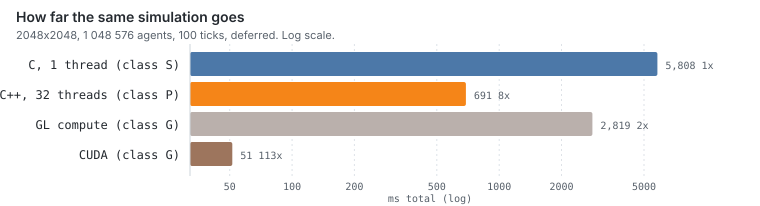
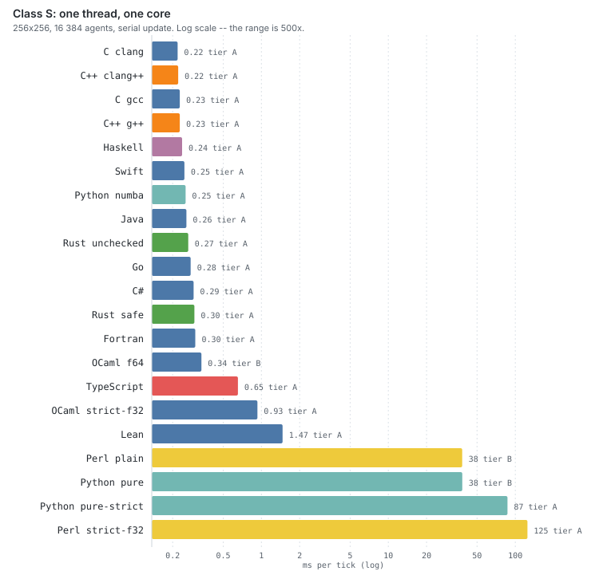
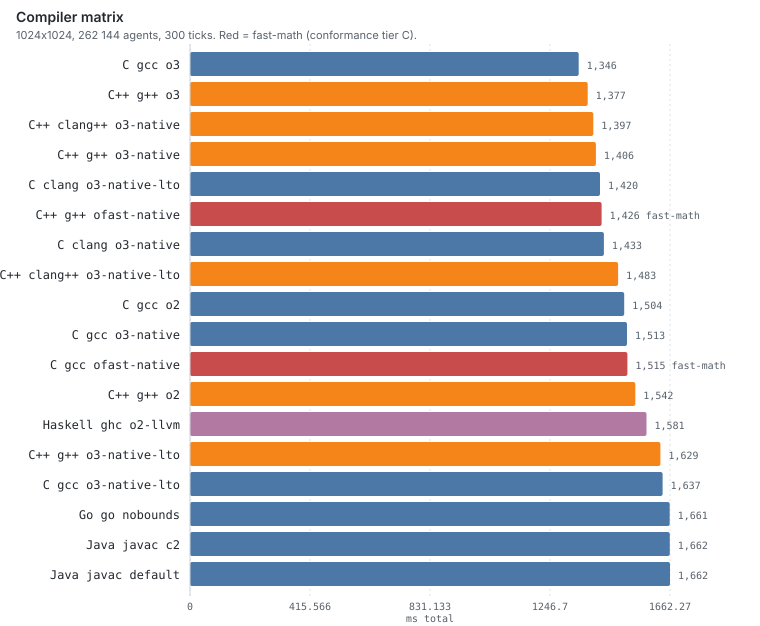
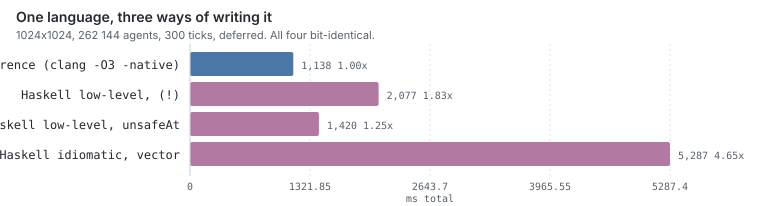
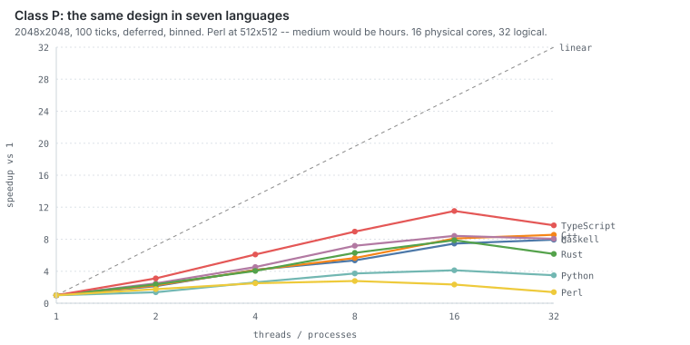
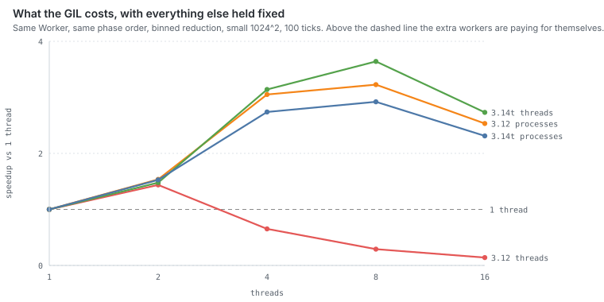
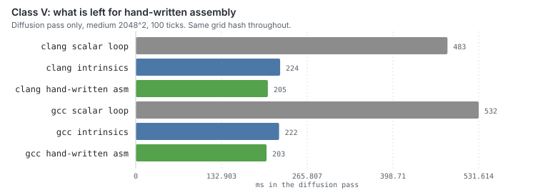
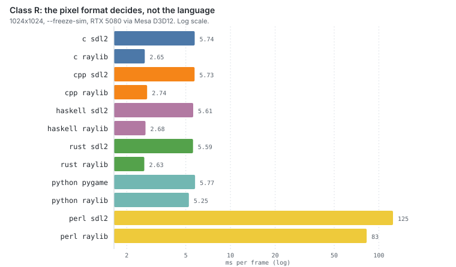

# Ergebnisse

Alle Zahlen in diesem Dokument stammen aus **einem** Lauf,
[`results/run-20260820-0330/`](../results/run-20260820-0330/), Commit
`41bdcc0`, erzeugt mit einem einzigen Aufruf von:

```bash
bench/full-run.sh
```

Das Ein-Lauf-Prinzip ist die Antwort auf einen Fehler früherer Fassungen: die
Zahlen waren über ein Dutzend Sitzungen an verschiedenen Tagen entstanden.
Innerhalb einer Reihe ist das unkritisch, über Reihen hinweg still irreführend.
Die Tabellen werden mit `bench/tables.py` aus dem Ergebnisverzeichnis erzeugt,
die Diagramme mit `bench/charts.py` aus demselben — abgetippt wird nichts.

```
cpu     AMD Ryzen 9 9950X3D  (16C/32T, Zen 5, 128 MB L3)
gpu     NVIDIA RTX 5080 (84 SMs), über Mesa D3D12
os      Ubuntu 24.04 unter WSL2, 46 GiB
gcc 13.3 · clang 18.1.3 · rustc 1.97.1 · GHC 9.10.3 · Node 25.5
go 1.25 · swift 6.3.3 · python 3.12.3 (+ 3.14t) · perl 5.38.2 · CUDA 12.0
```

> Zwei Einschränkungen vorweg. Der Lauf fand auf dem Windows-Dateisystem über
> die 9p-Brücke statt, nicht nach `scripts/stage-wsl.sh`; das verfälscht
> Build-Zeiten und I/O, von denen keine in diesem Dokument steht — die
> Simulation ist CPU-gebunden, Binärgrößen und RSS sind es ohnehin.
>
> Und: **Unterschiede unter etwa 5 % sind in diesen Tabellen nicht aufgelöst.**
> Drei Wiederholungen reichen dafür nicht, und zwei Reihen dreißig Minuten
> auseinander widersprechen sich bei kleinen Effekten bis hin zum Vorzeichen.
> Wo das eine Aussage betrifft, steht es dabei.

---

## Inhalt

1. [Die kurze Fassung](#1-die-kurze-fassung)
2. [Sprachvergleich (Klasse S)](#2-sprachvergleich-klasse-s)
3. [Compiler](#3-compiler)
4. [Wie sehr der Programmierstil zählt (Haskell)](#4-wie-sehr-der-programmierstil-zählt-haskell)
5. [Parallelität (Klasse P)](#5-parallelität-klasse-p)
6. [Was der GIL kostet (CPython 3.14t)](#6-was-der-gil-kostet-cpython-314t)
7. [SIMD und Handassembler (Klasse V)](#7-simd-und-handassembler-klasse-v)
8. [GPU (Klasse G)](#8-gpu-klasse-g)
9. [Rendering (Klasse R)](#9-rendering-klasse-r)
10. [Footprint](#10-footprint)
11. [Was nicht funktioniert hat](#11-was-nicht-funktioniert-hat)
12. [Wo ich mich geirrt habe](#12-wo-ich-mich-geirrt-habe)
13. [Offene Punkte](#13-offene-punkte)

---

## 1. Die kurze Fassung

Dieselbe Simulation, dreizehn Implementierungen in neun Sprachen, von einem
Perl-Interpreter bis zu 84 Streaming-Multiprozessoren.



| Klasse | beste Konfiguration | `medium`, 100 Ticks | vs. 1 CPU-Kern |
|---|---|---:|---:|
| S — ein Thread | C, gcc `-O3 -march=native` | 4391 ms | 1× |
| P — 32 Threads | **Go**, `binned` | 516 ms | **8.5×** |
| G — GPU | CUDA, RTX 5080 | **44 ms** | **100×** |

Zwei Dinge, die in dieser Tabelle nicht stehen und die interessantesten
Ergebnisse dieser Reihe sind:

**Klasse P gewinnt Go**, nicht C und nicht C++ — 516 ms gegen 550 und 551, bei
einem Einzelthread-Rückstand von 12 %. Der Grund steht in §5.

**Handgeschriebener AVX-512-Assembler schlägt die Intrinsics um rund 12 %**,
und zwar nicht mit besseren Befehlen, sondern mit einem Drittel der
Ladeoperationen; §7.

Klasse V steht nicht in der Tabelle, weil sie bei `small` gemessen wird — dort
bringt AVX-512 **1.25×** (1085 → 871 ms). Der Diffusionspass allein wird
4.5-mal schneller, macht aber nur ein Viertel der Laufzeit aus; §7.

Fünf Ergebnisse, die ich vorher nicht erwartet hätte:

- **Bit-Exaktheit hält durch alles hindurch.** 35 von 35 Stufe-A-Läufen im
  `serial`-Modus liefern `0x9E8B1688 / 0x0E6A2341`, 38 von 38 im
  `deferred`-Modus `0xAAB0115C / 0x328E3716`. Dazu Klasse P in allen neun
  Sprachen für jede Thread-Zahl, SIMD, Handassembler, CUDA bei jedem Preset,
  und alle 34 Zellen der CPython-Matrix. Die Spec hatte für SIMD und GPU
  jeweils das Gegenteil angenommen.
- **Eine Sprachrangliste aus einer Klasse überträgt sich nicht auf die
  nächste.** Go liegt in Klasse S auf Platz 8 von 14 und gewinnt Klasse P.
  TypeScript ist in Klasse S 3.6× langsamer als C und skaliert von allen am
  besten (9.8×). Haskell liegt in Klasse S bei 1.19× und trifft in Klasse R C.
- **Klasse R vergleicht nicht die Sprache.** Auf raylib liegen vier
  kompilierte Sprachen innerhalb von **10 %**. Was zählt, ist das Pixelformat.
- **Der GIL kostet nicht Skalierung, sondern Laufzeit.** CPython 3.12 mit
  16 Threads braucht das **7.3-fache** des Ein-Thread-Laufs, nicht dasselbe.
  Details in §6.
- **Fast jede „offensichtliche" Optimierung hat verloren.** PGO, die parallele
  Präfixsumme, der Lastausgleich, die reine Spin-Barriere — vier Versuche, ein
  brauchbares Ergebnis. Details in §11.

---

## 2. Sprachvergleich (Klasse S)

Ein Thread, skalar. 256×256 mit 16 384 Agenten und 100 Ticks — diese Größe ist
so gewählt, dass **auch Perl und reines Python sie in Sekunden schaffen**, denn
nur so passen alle Sprachen in eine Tabelle. Jede Implementierung steht einmal,
mit ihrem besten Profil; die Compiler-Achse hat ihren eigenen Abschnitt.



### `--update serial`

| # | Sprache | Profil | Konf. | ms/Tick | rel. | RSS MiB |
|---:|---|---:|:-:|---:|---:|---:|
| 1 | C (clang) | o3-native-lto | A | 0.179 | 1.00× | 18 |
| 2 | C++ (clang++) | o3-native | A | 0.200 | 1.12× | 18 |
| 3 | C (gcc) | o2 | A | 0.202 | 1.13× | 18 |
| 4 | C++ (g++) | o3 | A | 0.207 | 1.16× | 18 |
| 5 | **Haskell** | o2-llvm | A | **0.212** | **1.19×** | 18 |
| 6 | **Swift** | unchecked | A | **0.225** | **1.26×** | 19 |
| 7 | Rust (unchecked) | release-native-unchecked | A | 0.247 | 1.38× | 18 |
| 8 | **Go** | nobounds | A | **0.250** | **1.40×** | 18 |
| 9 | Rust (safe) | release-native | A | 0.277 | 1.55× | 18 |
| 10 | TypeScript | node | A | 0.636 | 3.56× | 80 |
| 11 | Perl | — | B | 35.39 | 198× | 22 |
| 12 | Python (pur) | — | B | 36.16 | 202× | 18 |
| 13 | Python (`--strict-f32`) | — | A | 80.80 | 452× | 18 |
| 14 | Perl (`--strict-f32`) | — | A | 116.08 | 649× | 22 |

**35 von 35 Stufe-A-Läufen: `0x9E8B1688 / 0x0E6A2341`.**

### `--update deferred`

Hier können auch numpy und die idiomatische Haskell-Fassung antreten.

| # | Sprache | Konf. | ms/Tick | rel. |
|---:|---|:-:|---:|---:|
| 1 | C (clang, o3-native) | A | 0.181 | 1.00× |
| 2 | C++ (clang++, o3-native) | A | 0.195 | 1.08× |
| 3 | C++ (g++, o3) | A | 0.202 | 1.12× |
| 4 | C (gcc, o3) | A | 0.205 | 1.13× |
| 5 | Haskell (o2-llvm) | A | 0.230 | 1.27× |
| 6 | Rust (unchecked) | A | 0.245 | 1.36× |
| 7 | Swift (unchecked) | A | 0.266 | 1.47× |
| 8 | Rust (safe) | A | 0.271 | 1.50× |
| 9 | Go (nobounds) | A | 0.277 | 1.53× |
| 10 | Haskell (idiomatisch, `vector`) | A | 0.459 | 2.54× |
| 11 | TypeScript | A | 0.671 | 3.71× |
| 12 | Python (numpy) | A | 1.039 | 5.74× |

**38 von 38 Stufe-A-Läufen: `0xAAB0115C / 0x328E3716`.**

Bemerkenswert:

- **Haskell ist auf Platz 5, vor Swift, Go und Rust.** Der Grund steht in §4:
  eine einzige Änderung (`Data.Array.Unboxed.(!)` → `unsafeAt`) war Faktor 1.5.
  Eine frühere Fassung dieses Dokuments hatte Haskell bei 2.16×.
- **Swift liegt vor Rust und Go**, bei 1.26× und mit 19 MiB RSS und 96 KiB
  Binärgröße. Von den drei jüngeren Systemsprachen im Feld ist es hier die
  schnellste — und die einzige, die dafür kein Flag braucht, das
  Bereichsprüfungen abschaltet: `-Ounchecked` bringt gegenüber `release` nur
  6 %, wo Rust 11 % verliert.
- **Go liegt im `serial`-Modus knapp vor Rust-safe, im `deferred`-Modus knapp
  dahinter.** Der Abstand zwischen Platz 6 und Platz 9 beträgt 12 %; die
  Reihenfolge dort ist nicht belastbar (siehe die Vorbemerkung).
- **Perl und reines Python liegen 2 % auseinander** (35.4 vs. 36.2 ms/Tick),
  und in dieser Reihe ist Perl das schnellere von beiden. Der
  Interpreter-Dispatch dominiert so vollständig, dass der Sprachunterschied
  verschwindet — welches der beiden vorne liegt, wechselt zwischen Reihen.
- **TypeScript mit Faktor 3.5** ist zwei Größenordnungen näher an C als an den
  anderen Skriptsprachen — und dabei in Konformitätsstufe A, weil `Math.fround`
  um jede Operation beweisbar dasselbe liefert wie f32-Arithmetik
  (`53 ≥ 2·24+2`).
- **numpy liegt bei 5.7×**, nicht bei 3.1× wie in einer alten Reihe. Der
  Unterschied ist der Refactor auf bereichsweise Pässe für Klasse P: die
  Diffusion sammelt ihre Zeilen jetzt per Indexarray statt per `np.roll` über
  das ganze Grid, was bei 256² relativ mehr kostet als bei 1024².
- **RSS ist fast überall 18 MiB**, weil das Grid ihn dominiert. Auffällig sind
  nur die Laufzeitumgebungen: Node mit 81 MiB, numpy mit 39.

### Was Bit-Exaktheit in den Skriptsprachen kostet

| Sprache | Stufe B | Stufe A | Aufschlag |
|---|---:|---:|---:|
| Python (pur) | 36.16 | 80.80 | 2.2× |
| Perl | 35.39 | 116.08 | 3.3× |

Deutlich billiger als erwartet, und das ist selbst der Befund: in einer Sprache,
die pro Operation ohnehin einen Interpreter-Dispatch zahlt, verschwinden neun
zusätzliche C-Level-Aufrufe pro Zelle weitgehend im vorhandenen Overhead.

Perl zahlt mehr als Python, weil ein Perl-Array volle Doubles speichert und
damit *jede* Operation gerundet werden muss, während Pythons `array('f')` beim
Store ohnehin auf f32 rundet.

---

## 3. Compiler

1024×1024, 262 144 Agenten, 300 Ticks, bester von drei Läufen. Neun Compiler
bzw. Toolchains, jede mit ihrer eigenen Profilachse.



| Sprache | Compiler | Profil | Konf. | ms | rel. | Binär KiB |
|---|---|---:|:-:|---:|---:|---:|
| C | clang | o3-native | A | **1085** | 1.00× | 54 |
| C++ | g++ | ofast-native | **C** | 1132 | 1.04× | 74 |
| C | gcc | o2 | A | 1148 | 1.06× | 50 |
| C++ | g++ | o3 | A | 1151 | 1.06× | 70 |
| C | clang | o3-native-lto | A | 1158 | 1.07× | 54 |
| C | gcc | o3 | A | 1159 | 1.07× | 58 |
| C++ | clang++ | o3-native | A | 1206 | 1.11× | 63 |
| C++ | g++ | o3-native | A | 1216 | 1.12× | 74 |
| C++ | clang++ | o3-native-lto | A | 1217 | 1.12× | 63 |
| C | gcc | ofast-native | **C** | 1248 | 1.15× | 62 |
| C++ | g++ | o2 | A | 1257 | 1.16× | 62 |
| C | gcc | o3-native | A | 1274 | 1.17× | 62 |
| C | gcc | o3-native-lto | A | 1288 | 1.19× | 54 |
| C | clang | o2 | A | 1292 | 1.19× | 50 |
| Haskell | ghc | o2-llvm | A | 1304 | 1.20× | 2860 |
| C | clang | o3 | A | 1322 | 1.22× | 50 |
| Swift | swift | unchecked | A | 1350 | 1.24× | 96 |
| C++ | g++ | o3-native-lto | A | 1368 | 1.26× | 66 |
| Go | go | nobounds | A | 1399 | 1.29× | 1552 |
| C++ | clang++ | o3 | A | 1415 | 1.30× | 59 |
| C++ | clang++ | o2 | A | 1420 | 1.31× | 59 |
| Swift | swift | release | A | 1434 | 1.32× | 100 |
| Rust | cargo | release-native-lto-unchecked | A | 1460 | 1.34× | 442 |
| Go | go | default | A | 1460 | 1.35× | 1592 |
| Rust | cargo | release-native-unchecked | A | 1481 | 1.36× | 475 |
| Rust | cargo | release | A | 1491 | 1.37× | 471 |
| Rust | cargo | release-unchecked | A | 1562 | 1.44× | 468 |
| C++ | clang++ | ofast-native | **C** | 1612 | 1.49× | 63 |
| Haskell | ghc | o2 | A | 1640 | 1.51× | 2832 |
| C | clang | ofast-native | **C** | 1643 | 1.51× | 54 |
| Rust | cargo | release-native | A | 1648 | 1.52× | 476 |
| Haskell | ghc | o1 | A | 2881 | 2.65× | 2779 |
| C | clang | o0 | A | 3522 | 3.25× | 54 |
| C | gcc | o0 | A | 4340 | 4.00× | 114 |
| C++ | clang++ | o0 | A | 4413 | 4.07× | 155 |
| C++ | g++ | o0 | A | 4837 | 4.46× | 166 |

**Alle Stufe-A-Läufe stimmen überein.** Die vier fast-math-Builds weichen ab,
und zwar *pro Compiler unterschiedlich* — genau deshalb ist fast-math eine
eigene Konformitätsstufe.

### `-Ofast` kostet clang die Hälfte und gcc nichts

| | `-O3 -march=native` | `-Ofast -march=native` | Δ |
|---|---:|---:|---:|
| C, clang | 1085 | 1643 | **+51 %** |
| C++, clang++ | 1206 | 1612 | **+34 %** |
| C, gcc | 1274 | 1248 | −2 % |
| C++, g++ | 1216 | 1132 | −7 % |

Bei clang ist der Effekt groß, reproduzierbar und geht in die falsche Richtung:
die Reassoziationsfreiheit lässt es den 9-Punkt-Stencil in etwas Schlechteres
umordnen. Der Diffusionspass allein steigt von 270 auf 815 ms.

**Bei gcc ist er es nicht.** Eine frühere Reihe maß hier +3 %, diese −2 %. Ein
Effekt, der zwischen zwei Messungen das Vorzeichen wechselt, ist kein Effekt.
Was bleibt: man bezahlt Determinismus und bekommt bei gcc nichts messbares und
bei clang einen Verlust.

### clang gewinnt — aber nur mit `-march=native`

`-O2`: gcc 1148, clang 1292. `-O3 -march=native`: gcc 1274, clang 1085.
Wer nur `-O2` vergleicht, schließt „gcc ist 11 % schneller"; wer
`-march=native` dazunimmt, „clang ist 15 % schneller". Derselbe Quelltext.
Dieser Befund hat inzwischen drei Reihen überlebt.

### LTO ist Rauschen

clang 1085 → 1158 mit LTO, gcc 1274 → 1288, g++ 1216 → 1368, clang++ 1206 →
1217. In dieser Reihe kostet LTO also überall zwischen 1 und 13 %; in der
vorherigen brachte es bei clang 3 % und kostete bei gcc 1 %. Bei Rust ist es
mit 1481 → 1460 ebenfalls im Rauschen. Die einzige belastbare Aussage ist,
dass LTO auf diesem Programm nichts tut, was man messen könnte — es ist eine
einzige Übersetzungseinheit mit vier Dateien.

### Bereichsprüfungen: Rust 11 %, Go 4 %, Swift 6 %

| Sprache | mit Prüfung | ohne | Kosten |
|---|---:|---:|---:|
| Rust | 1648 (`release-native`) | 1481 (`-unchecked`) | **11 %** |
| Swift | 1434 (`release`) | 1350 (`-Ounchecked`) | 6 % |
| Go | 1460 (default) | 1399 (`-gcflags=all=-B`) | 4 % |

Eine frühere Reihe hat den Rust-Wert aufgeschlüsselt: 28–35 % im
Diffusionspass, nichts messbares im Agenten-Pass. Die Prüfungen stehen der
Vektorisierung des Stencils im Weg; im Agenten-Pass wartet die CPU ohnehin auf
Cache-Misses. „Bounds-Checking kostet nichts" und das Gegenteil sind beide
falsch — es hängt am Zugriffsmuster, und dieser Benchmark hat zufällig beide
Sorten in einem Programm.

Dass Go und Swift weniger zahlen als Rust, liegt nicht an besseren Prüfungen,
sondern daran, dass ihre Diffusionsschleifen ohnehin nicht so weit
vektorisiert werden wie die von LLVM für Rust — es ist weniger zu verlieren.

### GHC: das LLVM-Backend lohnt sich

`-O1` 2881, `-O2` 1640, `-O2 -fllvm` **1304**. Das LLVM-Backend bringt **20 %**
gegenüber dem nativen Codegenerator, für 1 % mehr Binärgröße. Alle drei
bit-exakt. GHC 9.10 warnt, dass LLVM 18 außerhalb des unterstützten Bereichs
liegt, und macht trotzdem korrekt weiter — geprüft gegen die
Konformitätsvektoren, nicht geglaubt.

---

## 4. Wie sehr der Programmierstil zählt (Haskell)

Ein Haskell-Programmierer, der den Port gelesen hat, hat ihn so beschrieben:
*„it looks just like if you took the C and tried to just line by line re-create
it in Haskell — this is not how you write Haskell code."* Das trifft zu.
`impl/haskell/src/Sim.hs` ist `IOUArray` in `IO` mit handgeschriebener
Endrekursion und expliziter Indexarithmetik, und so schreibt das niemand, der
nicht gerade eine C-Referenz Anweisung für Anweisung nachbaut.

Derselbe Programmierer nannte zwei Dinge, die sich hier gegenseitig
widersprechen: dass man in Haskell üblicherweise *hochlevel* schreibt und GHC
machen lässt — und dass man mit sorgfältigem Low-Level-Code *nahe an C*
herankommt. Beides ist messbar.



`small`/300 `deferred`, alle vier bit-identisch (`0x7A67A29B`):

| Variante | ms | vs. C |
|---|---:|---:|
| C-Referenz, clang `-O3 -march=native` | 1138 | 1.00× |
| **Haskell low-level, `unsafeAt`** | **1420** | **1.25×** |
| Haskell low-level, `Data.Array.Unboxed.(!)` | 2077 | 1.83× |
| Haskell idiomatisch, `Data.Vector.Unboxed` | 5287 | 4.65× |

Alle vier Zeilen kommen aus derselben Messreihe wie der Rest dieses Dokuments.
Das war nicht immer so: die langsame `(!)`-Fassung wurde repariert, als sie
gefunden wurde, und ein Vergleich gegen eine Variante, die nicht mehr
kompiliert, ist keine Messung, sondern eine Erinnerung. Sie ist jetzt ein
Build-Profil (`o2-llvm-safetrig`, ein CPP-Schalter um vier
Tabellenzugriffe), damit sie sich mit allem anderen zusammen neu erzeugen
lässt.

Drei Befunde:

**„Nahe an C" stimmt — und hing an vier Zeichen.** Die Trigonometrie-Tabelle
wird viermal pro Agent gelesen. `Data.Array.Unboxed.(!)` ist die naheliegende
Schreibweise, geht aber über die `Ix`-Klasse, rechnet den Offset aus und prüft
die Grenzen — und GHC eliminiert beides nicht, obwohl die Grenzen
Compile-Time-Konstanten sind. Ersetzt durch `unsafeAt`: **1.46×** auf die
Gesamtzeit, und der Index war schon vorher mod NDIR reduziert, die Prüfung
konnte also nie auslösen.

**Hochlevel kostet hier 3.7× gegen den Low-Level-Port.** Die idiomatische
Fassung ist ehrlich idiomatisch: reine Funktionen über unveränderliche
`U.Vector`, kein `IO` im Kern, der Diffusionspass ist ein `U.generate`, der
Deposit-Scatter ein `U.accumulate`. Der Stencil ist als reine Abbildung genau
der Fall, in dem Fusion funktioniert. Der Agenten-Pass ist es nicht: jeder Tick
baut fünf neue Vektoren auf, wo die mutable Fassung in bestehende Puffer
schreibt.

**Der idiomatische Stil scheitert an derselben Stelle wie numpy.**
`--update serial` verlangt, dass ein Agent die Deposits seiner Vorgänger
*innerhalb desselben Ticks* sieht. Über unveränderliche Vektoren hieße das, das
Grid einmal pro Agent neu zu bauen. Die Implementierung lehnt den Modus mit
Exit-Code 3 ab — dieselbe Wand wie in
[`slimebench_numpy.py`](../impl/python/slimebench_numpy.py), aus demselben
Grund.

Und ein Fehler, den die getrennten Prüfsummen gefangen haben: die erste Fassung
akkumulierte die Deposits per `U.accumulate` direkt ins Grid. Zwei Deposits auf
dieselbe Zelle ergeben dann `(g + d₁) + d₂` statt der vorgeschriebenen
`g + (d₁ + d₂)` — 1 ULP, sobald `g` groß genug ist. Der *Grid*-Hash wich ab,
der *Agenten*-Hash nicht, und damit war der Fehler ohne Suche lokalisiert.
Genau dafür trennt [SPEC §6.3](../spec/SPEC.md) die beiden.

> Was das *nicht* zeigt: dass idiomatisches Haskell langsam ist. Es zeigt, dass
> es auf **dieser** Last langsam ist — ein mutables Gitter, das eine Million
> Mal pro Tick punktuell verändert wird. Das ist der ungünstigste denkbare Fall
> für persistente Datenstrukturen, und die Spec schreibt ihn vor.

---

## 5. Parallelität (Klasse P)

Nur im `deferred`-Modus — `serial` lässt Agenten die Deposits ihrer Vorgänger
im selben Tick sehen und ist damit prinzipiell nicht deterministisch
parallelisierbar.



`medium` (2048², 1 048 576 Agenten), 100 Ticks. Perl steht bei `tiny`, weil
`medium` dort Stunden dauern würde.

### `binned` — bit-identisch zum seriellen Lauf

| Sprache | T=1 | T=2 | T=4 | T=8 | T=16 | T=32 | Speedup |
|---|---:|---:|---:|---:|---:|---:|---:|
| **Go** | 4916 | 2115 | 1442 | 814 | 578 | **516** | **9.5×** |
| C | 4391 | 2101 | 1112 | 873 | 627 | **550** | 8.0× |
| C++ | 4127 | 2083 | 1176 | 854 | 636 | **551** | 7.5× |
| Haskell | 4861 | 2168 | 1096 | **753** | 667 | 741 | 7.3× |
| Swift | 5625 | 2380 | 1787 | 891 | **653** | 845 | 8.6× |
| Rust | 5724 | 2568 | 1594 | **979** | 845 | 993 | 6.8× |
| TypeScript | 11310 | 3861 | 2142 | 1475 | **1151** | 1276 | **9.8×** |
| Python | 7532 | 5478 | 3041 | 1932 | **1712** | 2085 | 4.4× |
| Perl ¹ | 4018 | 2288 | 1647 | **1469** | 1672 | 2485 | 2.7× |

¹ `tiny`, replizierte Reduktion — siehe unten.

### `private` — nur je Thread-Zahl reproduzierbar

| Sprache | T=2 | T=4 | T=8 | T=16 | T=32 |
|---|---:|---:|---:|---:|---:|
| C | 2472 | 1458 | **1173** | 2500 | 5747 |
| C++ | 2319 | 1414 | **1139** | 2463 | 5595 |
| Go | 1783 | 1151 | **1132** | 2211 | 5073 |
| Swift | 1828 | **1106** | 1087 | 2184 | 5546 |
| Haskell | 1649 | 1097 | **1062** | 2509 | 6235 |
| Rust | 2760 | 1573 | **1272** | 2495 | 5304 |
| TypeScript | 6230 | 3594 | **2495** | 2828 | 5803 |
| Python | 4689 | 2780 | **2056** | 2196 | 3038 |

**`private` fällt bei 32 Threads unter die serielle Laufzeit** — in C auf
5747 ms gegen 4391. Die Reduktion liest `T` vollständige Grids: bei `medium`
und 32 Threads sind das 512 MiB Speicherverkehr pro Tick, nur um Deposits
zusammenzuzählen. `binned` braucht dafür 8 MiB, unabhängig von der Thread-Zahl.
Die Strategie, die man naiv zuerst schreibt, ist also nicht nur die schwächere
Garantie, sondern ab acht Threads auch die langsamere.

### Go gewinnt Klasse P

Bei 32 Threads ist Go mit **516 ms** die schnellste Implementierung im Feld,
vor C++ (551) und C (550) — bei einem Einzelthread-Rückstand von 12 % gegenüber
C. Es ist auch die einzige Sprache, deren `binned`-Kurve bis 32 Threads
monoton fällt; C, C++, Haskell, Rust und Swift haben ihr Minimum bei 16 oder
biegen danach wieder hoch.

Die Form der Kurve sagt, wo es herkommt: bei T=4 liegt Go mit 1442 ms
*deutlich hinter* C (1112), bei T=32 vorn. Der Vorteil wächst also mit der
Zahl der Teilnehmer, was auf die Synchronisation zeigt und nicht auf den
Rechenkern — sechs Barrieren pro Tick mal 32 Worker sind 192 Weckvorgänge, und
Gos Barriere ist ein `sync.Cond` über einem Mutex, der wartende Goroutinen im
Runtime-Scheduler parkt, wo C `futex` und C++ `std::condition_variable`
benutzen.

> Das ist die plausible Erklärung, nicht die gemessene. Sie zu belegen hieße,
> die Barrieren gegeneinander zu tauschen oder die Wartezeit pro Phase zu
> instrumentieren; beides ist offen. Nach §12 dieses Dokuments sind
> ungemessene Performance-Erklärungen die Kategorie, in der ich bisher
> zuverlässig danebenlag.

### Determinismus

| `deposit` | Strategie | T=1 | T=4 | T=32 |
|---|---|---|---|---|
| 10.0 (Default) | `binned` | `0xC5C53969` | ✓ | ✓ |
| 10.0 | `private` | `0xC5C53969` | ✓ | ✓ |
| **0.1** | `binned` | `0x95EEB32D` | ✓ | ✓ |
| **0.1** | `private` | `0x95EEB32D` | `0xE82B2012` ✗ | ✗ |

`binned` ist bit-identisch zu T=1 für **jede** Thread-Zahl, geprüft für
T ∈ {2,3,4,7,8,16,32}, also auch für Zahlen, die kein Teiler der Höhe sind.

`private` stimmt mit den Default-Parametern *zufällig* auch: bei
`deposit = 10.0` bleibt jede Teilsumme `k · 10` unter 2²⁴ und ist in f32 exakt.
Mit `--deposit 0.1` bricht das sofort — und **fünf Sprachen liefern bei T=4
denselben falschen Hash `0xE82B2012`**. Dieselbe Klammerung, derselbe Fehler.
Das ist ein besserer Beleg dafür, dass die Ports dieselbe Rechnung machen, als
es die richtigen Ergebnisse allein wären.

### Was die einzelnen Sprachen kostet

**TypeScript skaliert am besten unter den Nicht-Systemsprachen, obwohl es in
Klasse S 3.6× zurückliegt.** Der Abstand zu C schrumpft von 3.6× auf 2.3×. Und `binned` ist dort bei *zwei*
Threads schon 3.1× schneller als ein Thread — das ist nicht die Parallelität,
sondern die Lokalität: bei gleicher Thread-Zahl schlägt `binned` die
`private`-Strategie um 1.63×, in C nur um 1.10×. Die Zielzellen sequenziell in
`aidx` zu schreiben und sie danach zeilenblockweise anzuwenden ersetzt ein
gestreutes Read-Modify-Write über 16 MiB durch einen sequenziellen Write plus
einen sortierten. In V8 ist das viel mehr wert als in C.

**Haskells Barriere ist `MVar`-basiert, nicht STM.** Die STM-Variante liest
sich schöner (`retry` blockiert, bis der Generationszähler sich ändert), aber
jeder Wartende validiert seine Transaktion bei jedem Aufwachen neu, und bei
sechs Barrieren pro Tick ist das ein Retry-Sturm.

**Python zahlt für den GIL mit Prozessen.** `threading` würde genau die
Schleifen serialisieren, um die es geht — numpy gibt den GIL in großen
ufunc-Aufrufen frei, aber der Agenten-Pass ist eine Kette von Dutzenden
kleiner, mit Python-Code dazwischen, und der hält das Lock. Also
`multiprocessing` über einen `shared_memory`-Block, jedes Array von Hand
platziert. Was das kostet, und was ein freithreadiges CPython daran ändert,
steht in §6 — es ist ein eigener Abschnitt geworden, weil sich beide Backends
gegeneinander messen lassen. Nebeneffekt: die Barriere ist ein OS-Objekt und kostet
Zehner-Mikrosekunden statt Hunderter-Nanosekunden — in C wäre das der
Flaschenhals, hier verschwindet es in einem Tick von 23 ms. Die langsamste
Implementierung kann sich die teuerste Barriere leisten.

**Perl hat Threads, und sie sind hier das falsche Werkzeug.** Gemessen, für
262 144 Elemente:

| Operation | einfaches Array | `threads::shared` | Faktor |
|---|---:|---:|---:|
| sequenzielles Read-Modify-Write | 4.5 ms | 78.2 ms | 17× |
| zufälliges Read-Modify-Write | 13.9 ms | 105.7 ms | **7.6×** |
| `pack`+`unpack` derselben Werte | 12.0 ms | – | – |

Der Diffusionsstencil liest neun Zellen pro Ausgabezelle. Ein geteiltes Grid
müsste also erst Faktor 7.6 aufholen, bevor der erste Thread etwas beiträgt.
Ein ganzer Block durch `pack`/`unpack` kostet dagegen etwa so viel wie *ein*
Durchlauf über ein normales Array. Also `fork` mit privaten Grids, und über die
Pipes läuft nur gepacktes Binär.

Das erzwingt eine dritte Reduktionsstrategie, die
[SPEC §5.6](../spec/SPEC.md) nicht kennt: **repliziert**. Jeder Prozess wendet
*jeden* Deposit an, in aufsteigendem Agentenindex — also exakt die serielle
Kette, bit-identisch für jede Prozesszahl, ohne den `binned`-Sort. Der Preis
ist, dass Deposit- und Merge-Pass N-mal statt einmal laufen, und genau das
deckelt den Speedup bei 2.8×: parallel ist nur der Agenten-Pass.

### Der Flaschenhals sind die Barrieren

`SLIMEBENCH_PHASE_STATS=1` trennt Arbeit und Barrierenwartezeit
(C, `medium`, T=16, Thread 0):

| Phase | Arbeit | Barriere | Summe |
|---|---:|---:|---:|
| agents | 2.755 | 1.085 | 3.839 |
| prefix | **0.000** | 0.265 | 0.265 |
| scatter | 0.074 | 0.269 | 0.343 |
| deposit | 0.425 | 0.335 | 0.761 |
| merge | 0.356 | 0.354 | 0.710 |
| diffuse | 0.424 | — | 0.424 |

**Barrieren sind 35 % der Laufzeit bei T=16 und 53 % bei T=32.** Die
Präfixsumme, die vorher als „serielle O(T²)-Sektion" im Verdacht stand, leistet
0,000 ms messbare Arbeit.

Codeumfang für dieselbe Garantie: **C 326 Zeilen, C++ 264** — der Unterschied
steckt fast vollständig im Lebenszyklus (`std::jthread` joint beim Zerstören,
`std::barrier` braucht kein `init`/`destroy`).

---

## 6. Was der GIL kostet (CPython 3.14t)

Ein kontrolliertes Experiment: derselbe `Worker`, dieselbe Phasenfolge,
dieselbe Reduktion, dieselbe Maschine. Verändert wird genau zweierlei — welcher
Interpreter läuft (3.12 mit GIL, 3.14t ohne) und was die Worker trägt
(`threading.Thread` über gewöhnlichen numpy-Arrays, oder `multiprocessing` über
einem `shared_memory`-Block). `--mp-backend threads|processes`.



`small` (1024², 262 144 Agenten), 100 Ticks. Ein Thread: 3.12 **1907 ms**,
3.14t **1751 ms**.

**`binned`** — ms, in Klammern der Speedup gegen denselben Interpreter bei
einem Thread:

| | 3.12 Threads | 3.12 Prozesse | 3.14t Threads | 3.14t Prozesse |
|---|---:|---:|---:|---:|
| T=2 | 1459 (1.31×) | 1229 (1.55×) | 1197 (1.46×) | 1201 (1.46×) |
| T=4 | 3025 (**0.63×**) | 618 (3.08×) | **560** (3.13×) | 627 (2.79×) |
| T=8 | 6761 (**0.28×**) | 584 (3.26×) | **493** (3.55×) | 598 (2.93×) |
| T=16 | 13933 (**0.14×**) | 797 (2.39×) | **643** (2.72×) | 796 (2.20×) |

**`private`**:

| | 3.12 Threads | 3.12 Prozesse | 3.14t Threads | 3.14t Prozesse |
|---|---:|---:|---:|---:|
| T=2 | 1198 (1.59×) | 999 (1.91×) | 971 (1.80×) | 952 (1.84×) |
| T=4 | 2493 (0.77×) | **456** (4.18×) | 464 (3.77×) | 490 (3.58×) |
| T=8 | 5932 (0.32×) | **413** (4.61×) | 405 (4.33×) | 428 (4.09×) |
| T=16 | 12502 (0.15×) | 496 (3.84×) | 487 (3.60×) | 514 (3.41×) |

**Alle 34 Läufe liefern dasselbe Ergebnis:** Grid `0x65DF83A7`, Agenten
`0xE02D7B6A` — über zwei Interpreter, zwei Backends, vier Thread-Zahlen und
beide Reduktionen.

### Die erste Spalte ist der eigentliche Befund

CPython 3.12 mit Threads skaliert nicht bloß nicht, es **degradiert
superlinear**: 13.9 Sekunden bei 16 Threads gegen 1.9 bei einem, also
**7.3× langsamer** als der serielle Lauf. Und zwar sauber proportional zur
Thread-Zahl — 0.63×, 0.28×, 0.14× ist fast exakt eine Halbierung pro
Verdopplung.

Das ist mehr, als „der GIL serialisiert" erklärt: reine Serialisierung wäre
1.0×, nicht 0.14×. Die Größenordnung passt zu Konvoi-Verhalten an den
Barrieren. 139 ms pro Tick bei 16 Threads und sechs Barrieren sind 96
Durchläufe zu je 1.4 ms, und CPythons Umschaltintervall liegt bei 5 ms — ein
Wartender, der den GIL an der Barriere abgibt, bekommt ihn also nicht sofort
zurück. Nachgemessen habe ich das nicht; es ist die Rechnung, die aufgeht,
nicht der Beleg.

### Ohne GIL schlagen Threads Prozesse — aber nur bei `binned`

In `binned` gewinnen Threads bei jeder Thread-Zahl, bei T=8 um 18 %
(493 gegen 598 ms) und bei T=16 um 19 %. In `private` liegen sie gleichauf
(405 gegen 428, 487 gegen 496 — innerhalb des Rauschens).

Der Unterschied zwischen den beiden Reduktionen ist die Zahl der Phasen:
`binned` hat fünf, `private` hat zwei. Jede Phasengrenze ist eine Barriere, und
eine Barriere zwischen Prozessen ist ein OS-Objekt, wo eine zwischen Threads
ein Futex im selben Adressraum ist. Wo mehr synchronisiert wird, zahlt sich
der gemeinsame Adressraum aus.

### Und die ehrliche Lesart

**Der schnellste Wert der ganzen Tabelle gehört CPython 3.12** — 413 ms,
`private`, acht Prozesse. Free-Threading macht diese Last also nicht schneller.
Es macht die Umgehung überflüssig: kein `shared_memory`-Block, keine von Hand
gerechneten Byte-Offsets, keine `fork`-Pflicht, keine Rückkopie der Arrays am
Ende. Rund 120 der 350 Zeilen in
[`slimebench_mp.py`](../impl/python/slimebench_mp.py) existieren nur, weil
Threads bisher keine Option waren.

Der Ein-Thread-Vergleich (1751 gegen 1907 ms) sieht aus wie ein Argument dafür,
dass Free-Threading nichts kostet — **er ist keines**. Die beiden Interpreter
tragen numpy 2.5.2 und 1.26.4, und der Unterschied zwischen zwei numpy-Versionen
ist genau die Größenordnung, um die es hier geht. Das Paar ist konfundiert und
steht nur da, damit die Speedups eine Basis haben.

---

## 7. SIMD und Handassembler (Klasse V)

Explizite Intrinsics für den Diffusionspass, `--simd`, `small`/300. Der
Agenten-Pass bleibt skalar: mehrere Agenten pro Vektor deponieren routinemäßig
in dieselbe Zelle, was Konfliktauflösung bräuchte — und das wäre dann echt
Stufe C.

| Sprache | Compiler | ISA | gesamt | Diffusion | Diffusion skalar ¹ | Faktor |
|---|---|---|---:|---:|---:|---:|
| C | clang | AVX-512 | **871** | 60.2 | 270.0 | 4.49× |
| C++ | g++ | AVX2 | 927 | 66.1 | 284.6 | 4.31× |
| C | gcc | AVX2 | 935 | 65.8 | 282.7 | 4.30× |
| C++ | clang++ | AVX-512 | 956 | 56.3 | 271.5 | 4.82× |
| C++ | g++ | AVX-512 | 979 | **53.5** | 284.6 | **5.32×** |
| C | clang | AVX2 | 997 | 66.1 | 270.0 | 4.09× |
| C | gcc | AVX-512 | 1037 | 55.9 | 282.7 | 5.06× |
| C++ | clang++ | AVX2 | 1136 | 66.5 | 271.5 | 4.08× |
| Rust | cargo | AVX-512 (unchecked) | 1188 | 58.2 | 271.6 | 4.67× |
| Rust | cargo | AVX-512 (safe) | 1219 | 59.1 | 388.4 | **6.57×** |

¹ Skalare Vergleichszahl ist immer der `-O3 -march=native`-Build derselben
Sprache und desselben Compilers, auch in den AVX2-Zeilen (`-march=x86-64-v3`).

### Es ist Stufe A

Der Kernel hat **keine Cross-Lane-Reduktion**: jede Lane rechnet eine
Ausgabezelle mit exakt derselben Operationsfolge wie die skalare Schleife.
Bit-identisch unter gcc und clang, in beiden Update-Modi, auch mit
`--threads 16 --deposit-reduce binned`.

Zwei Bedingungen: kein FMA (`4.0f*c + acc` als eine gerundete Operation wäre
eine andere Zahl) und eine echte `_mm*_div_ps`.

### Der Stencil wird 4.5×, das Programm 1.25×

Die Diffusion fällt von ~275 auf ~58 ms, aber sie ist nur ein Viertel der
Laufzeit — der Agenten-Pass bleibt skalar und dominiert. Amdahl, in einer Zeile.

**Verdoppelte Vektorbreite kauft wenig.** AVX2 gegen AVX-512: bei gcc 65.8
gegen 55.9 ms (18 %), bei clang 66.1 gegen 60.2 (10 %), bei clang++ 66.5 gegen
56.3 (18 %). Der 3×3-Stencil liest 36 Byte, um 4 zu schreiben — er ist
bandbreitengebunden, die Ausführungseinheiten warten auf Speicher, und die
doppelte Breite hilft nur bei den Lade-Ports.

**Rusts „safe" gewinnt hier den größten Faktor, und das ist ein Artefakt.**
6.57× klingt beeindruckend, ist aber nur groß, weil der *skalare* Vergleichswert
schlecht ist: mit Bounds-Checks kostet der skalare Stencil 388 ms statt 272.
Der SIMD-Kernel geht in beiden Fällen über rohe Zeiger und landet bei 58–59 ms.
Wer Faktoren gegen die eigene Baseline meldet, misst manchmal die Baseline.

**Neben dem `-Ofast`-Befund aus §3 gelesen** wird die Spanne absurd. Derselbe
Diffusionspass, derselbe Compiler (clang), dasselbe Preset:

| Strategie | ms |
|---|---:|
| `-Ofast`, clang überlassen | 815.3 |
| `-O3 -march=native`, clang überlassen | 270.0 |
| Intrinsics | 60.2 |

**Faktor 13.5 zwischen der besten und der schlechtesten Art, dieselbe Schleife
zu vektorisieren** — und die schlechteste ist die, bei der man dem Compiler am
meisten Freiheit gibt.

### Und was danach noch übrig ist: Handassembler

Der Intrinsics-Kern ist bereits Stufe A und bereits 4.5× über der skalaren
Schleife. Dieselbe Sache noch einmal in Assembler zu schreiben, würde den
Assembler messen. [`impl/asm/sb_diffuse_avx512.S`](../impl/asm/sb_diffuse_avx512.S)
macht deshalb etwas anderes — dieselbe Arithmetik, andere Speicherstrategie:

> Der Intrinsics-Kern setzt **neun unausgerichtete Loads pro Ausgabevektor** ab:
> drei Zeilen mal `x-1`, `x`, `x+1`. Die drei lesen fast dieselben Bytes.
>
> Der handgeschriebene setzt **drei** ab. Er hält den vorherigen, aktuellen und
> nächsten 16-Lane-Vektor jeder Zeile in Registern und erzeugt die verschobenen
> Sichten mit `VALIGND`, das zwei Vektoren aneinanderhängt und über alle 512 Bit
> hinweg um ganze Doublewords schiebt. Pro Ausgabevektor: drei Loads, sechs
> `VALIGND`, ein Store.



`medium` 2048², nur der Diffusionspass, bester von drei Läufen:

| Kern | gcc | clang |
|---|---:|---:|
| skalare Schleife | 452.3 | 431.4 |
| Intrinsics | 203.5 | 192.3 |
| **Handassembler** | **160.7** | **166.9** |
| Vorsprung gegen Intrinsics | **21 %** | **13 %** |

Alle drei Kerne, beide Compiler, ein Grid-Hash: `0x0391F3BD`.

Die 21 % sind zu gut. Über fünf Messreihen liegt der Vorsprung zwischen 5 %
und 21 %, Median etwa 11 %; eine Kontrollmessung mit neun statt drei
Wiederholungen ergab 9 % (gcc) und 13 % (clang). Was in allen Reihen stabil
bleibt: die Assembler-Zahl selbst streut halb so stark wie die der Intrinsics
(161–175 gegen 183–213 ms). Sie ist schneller, und sie ist gleichmäßiger.

Zwei Nebeneffekte, die nicht in der Tabelle stehen:

**Der Torus-Umlauf wird gratis.** Die Zeile ist eine Zweierpotenz lang, also
ist der Byte-Offset des nächsten Vektors `(xo + 64) & (rowbytes - 1)` — ein
einziges `AND`. Damit sind der erste und der letzte Vektor einer Zeile
gewöhnliche Iterationen. Der Intrinsics-Kern kann das nicht ausdrücken und
schält von jeder Zeile einen skalaren Kopf und Schwanz ab.

**Die beiden Compiler landen 4 % auseinander** (160.7 gegen 166.9), wo sie bei
der skalaren Schleife 5 % und bei den Intrinsics 6 % auseinanderliegen. Das
muss so sein: an dieser Datei hat keiner von beiden mitgeschrieben.

`VALIGND` ist auch der Grund, warum es AVX-512 bleibt. AVX2s `VPALIGNR` schiebt
innerhalb der beiden 128-Bit-Hälften und kann keine Lane über die Mitte
bewegen; dieselbe Idee kostet dort ein `VPERM2F128` je Verschiebung und lohnt
nicht mehr. Eine AVX2-Fassung dieser Datei wäre der Intrinsics-Kern in lang.

Gebaut wird sie mit `ASM=1`, ausgewählt mit `--asm`. `sb_asm.c` verweigert mit
Begründung, wenn die CPU kein AVX-512F hat oder die Breite kein Vielfaches von
64 ist — der Ringpuffer ist vierfach über sechzehn Lanes ausgerollt — statt
still etwas anderes zu rechnen.

### SIMD und Threads sind Substitute

Beide greifen dieselbe Ressource an. Sobald acht Kerne am bandbreitengebundenen
Diffusionspass arbeiten, ist die Bandbreite ausgereizt: bei T=1 bringt SIMD
1.10×, bei T=8 exakt 1.00×, bei T=16 1.04× (frühere Reihe). Für den
Assembler-Kern gilt dasselbe Argument — er spart Ladeoperationen, und
Ladeoperationen sind genau das, was bei acht Threads knapp wird.

### Aufwand: Rust braucht mehr Zeremonie

C und C++ wählen die ISA mit `#ifdef __AVX512F__`, das `-march=native` setzt.
Rust hat `cfg!(target_feature = "avx512f")`, verlangt aber zusätzlich
`#[target_feature(enable = "avx512f")]` an der Funktion, die damit `unsafe`
aufzurufen ist. `std::simd` wäre portabler, ist aber weiterhin nightly-only.

---

## 8. GPU (Klasse G)

Drei Hosts: CUDA, ein GLSL-4.3-Compute-Shader aus C, und derselbe Shader aus
Python. Alle nur `deferred`, 100 Ticks.

| Host | tiny | small | medium | large | huge |
|---|---:|---:|---:|---:|---:|
| CUDA | 8 | 16 | **44** | 191 | 1065 |
| *MCUPS* | 3202 | 6753 | **9433** | 8764 | 6300 |
| GL 4.3, C-Host | 214 | 660 | 2379 | 9246 | 39941 |
| *MCUPS* | 122 | 159 | 176 | 181 | 168 |
| GL 4.3, Python-Host | 225 | 656 | 2391 | 9321 | 39956 |
| *MCUPS* | 116 | 160 | 175 | 180 | 168 |

### Klasse G misst nicht die Sprache — jetzt belegt

Der C-Host und der Python-Host fahren **denselben Shader**, und das ist
nachprüfbar statt behauptet: die GLSL liegt in
[`impl/glcompute/shaders/`](../impl/glcompute/shaders/), der C-Header wird
daraus generiert, und beide Hosts drucken einen FNV-32 ihrer kompilierten
Quelle — `0xB949F398` in beiden.

Die Zeiten liegen **unter 5 % auseinander** (bei `small` und `huge` sogar
unter 1 %), und jeder Grid-Hash stimmt überein —
**auch die vom Treiber abweichenden**. Der Python-Host reproduziert also die
ULP-Abweichung von Mesas D3D12-Pfad exakt, was ein stärkeres Ergebnis ist, als
wenn beide nur das richtige Ergebnis geliefert hätten.

Alles oberhalb des Shaders ist unabhängig implementiert: der Python-Host macht
seine eigene SPEC-1-3.3-Initialisierung in numpy, baut seine eigenen Puffer und
schreibt seine eigenen Uniforms. Rund 200 Zeilen gegen die 480 des C-Hosts.

### `medium` sättigt, alles darüber fällt ab

CUDAs Durchsatz steigt bis `medium` auf 9433 MCUPS und fällt danach — bei
`huge` (8192², 67 Mio. Zellen) ist er wieder unter dem Stand von `small`. Der
Speedup gegenüber einem C-Thread ist bei `medium` bereits **hundertfach**:
44 ms gegen 4391. Für `large` und `huge` fehlt die serielle C-Vergleichszahl in
dieser Reihe — der Thread-Sweep läuft nur bei `medium`, weil ein einzelner
C-Thread bei `huge` gut zehn Minuten pro Datenpunkt braucht.

### CUDA ist bit-exakt

Geprüft gegen die C-Referenz bei allen fünf Presets, Grid- **und**
Agenten-Hash: identisch. Nötig dafür:

1. **`-fmad=false`** — sonst fusioniert nvcc `4.0f*c + acc`.
2. **`--prec-div=true`** (Default) — korrekt gerundete Division.
3. **Ganzzahlige Deposit-Atomics.** `atomicAdd(float*)` ist nicht
   deterministisch; die Reihenfolge der ankommenden Threads bestimmt die
   Rundung. Stattdessen zählt `atomicAdd(unsigned*)` die Treffer pro Zelle —
   ganzzahlige Addition ist exakt und reihenfolgeunabhängig — und die
   Multiplikation mit `deposit` passiert einmal danach.

Punkt 3 bringt dieselbe Einschränkung mit wie `private`: mit `--deposit 0.1`
weicht auch CUDA ab. Geprüft, nicht angenommen.

### GLSL: exakt auf einem Treiber, nicht auf dem anderen

Auf Mesas `llvmpipe` ist der GL-Pfad bit-exakt gegen C. Auf D3D12/NVIDIA weicht
er um **maximal 2 ULP** ab: `precise` verbietet in GLSL Umordnen und Fusion,
erzwingt aber keine korrekt gerundete Division — genau das, was CUDA über
`--prec-div=true` bekommt. Klasse G ist deshalb pro Backend einzustufen.

Auf dem Weg dahin: zuerst wich auch der *Agenten*-Hash ab, weil `precise` nur
auf dem Diffusions-Akkumulator stand. `x + cos*step` im Agenten-Pass wird
ebenfalls fusioniert, versetzt den Agenten um ein ULP und kippt irgendwann
einen Sensorvergleich. Dass ausgerechnet der Agenten-Hash brach, hat den Fehler
lokalisiert.

> Die GL-Zahlen messen nicht OpenGL, sondern die Mesa-D3D12-Übersetzung: drei
> Dispatches, drei `GL_ALL_BARRIER_BITS` und ein `glFinish` pro Tick, alles
> über GL → DXIL → D3D12. Der Durchsatz bleibt über vier Größenordnungen bei
> ~170 MCUPS konstant, was heißt, dass die Übersetzungsschicht und nicht die
> GPU der Flaschenhals ist. Auf einem nativen Linux-GL-Treiber wäre der Abstand
> zu CUDA mit ziemlicher Sicherheit deutlich kleiner.

### Warum numpy `serial` nicht kann

`serial` verlangt, dass Agent *i* den Deposit von Agent *i−1* aus demselben
Tick sieht — eine sequenzielle Abhängigkeit durch das Grid. Kein
numpy-Ausdruck bildet sie ab. Die Implementierung lehnt den Modus mit
Exit-Code 3 und Begründung ab, statt still etwas anderes zu rechnen.

In `deferred` gibt es die Abhängigkeit nicht, und `np.add.at` akkumuliert
ungepuffert in Indexreihenfolge — exakt die vorgeschriebene.

---

## 9. Rendering (Klasse R)

1024², `--freeze-sim` (Simulation angehalten, damit nur der Upload-Pfad
Grid → Textur → Bildschirm gemessen wird). Millisekunden pro Frame, Median.



| Sprache | Bindung | SDL2 llvmpipe | SDL2 RTX 5080 | raylib llvmpipe | raylib RTX 5080 |
|---|---|---:|---:|---:|---:|
| C | direkt | 2.883 | 4.092 | 2.036 | 1.844 |
| C++ | direkt | 2.861 | 4.177 | 2.027 | 1.825 |
| Haskell | `sdl2` / `foreign import` | **2.682** | 3.995 | **1.927** | 1.821 |
| Rust | `sdl2` / `raylib` crate | 2.695 | **3.950** | 1.948 | **1.675** |
| Python | pygame / cffi | 5.238 | 5.297 | 4.325 | 4.263 |
| Perl | FFI::Platypus | 110.3 | 119.6 | 74.0 | 75.1 |

Die sechs SDL2- und raylib-Frontends von C, C++ und Rust haben inzwischen ein
HUD; unter `--json` ist es aus, und seine Zeichenzeit wird ohnehin aus dem
Frame herausgerechnet (§9, Ende).

**raylib gewinnt überall, und auf der echten GPU deutlicher:** 1.4× auf
Software, **2.2×** auf der RTX 5080, in jeder kompilierten Sprache. Die Ursache
ist das Pixelformat, nicht die Bibliothek — raylib nimmt den
8-Bit-Graustufenpuffer direkt entgegen (`UNCOMPRESSED_GRAYSCALE`), SDL2 braucht
ARGB8888 und damit eine Expansionsschleife über eine Million Pixel pro Frame.

**Die vier kompilierten Sprachen liegen auf raylib innerhalb von 10 %**
(1.675–1.844 ms), auf Software innerhalb von 8 %. Wenn das Backend und das Pixelformat feststehen, ist die
Sprache in dieser Klasse fast egal — was der interessanteste Befund der Tabelle
ist, weil er dem Klasse-S-Bild widerspricht.

**SDL2 ist auf der echten GPU langsamer als auf dem Software-Rasterizer**, in
allen vier kompilierten Sprachen (2.8 → 4.0 ms), während raylib auf beiden
gleich schnell bleibt. Beide Pfade sind bei 1024² CPU-gebunden; SDL2 zahlt auf
D3D12 zusätzlich für den `SDL_LockTexture`-Pfad durch die Übersetzungsschicht.
Für eine GPU-limitierte Messung bräuchte es ein deutlich größeres Grid.

**Python liegt 2× zurück, und der Backend-Unterschied verschwindet fast.** Der
Frame wird von der numpy-Konvertierung dominiert, nicht vom Upload.

**Perl liegt 40–60× zurück, zeigt den Backend-Unterschied aber am
deutlichsten** (110 gegen 74 ms). Hier hatte ich das Gegenteil erwartet: wenn
die Konvertierung den Frame dominiert, sollten beide Backends gleich
herauskommen, wie bei Python. Sie tun es nicht, weil die Konvertierung *selbst*
der Unterschied ist — raylib will ein Byte pro Pixel (`pack 'C*'`), SDL2 ein
geschobenes und verodertes 32-Bit-Wort (`pack 'L*'`), und in Perl kostet diese
Arithmetik mehr als alles andere im Frame zusammen.

### Zwei Bindungen, die nicht das Naheliegende sind

Für **Haskell/raylib** und **Perl/raylib** steht nicht das jeweilige
Ökosystem-Paket im Baum (`h-raylib`, `Raylib::FFI`), sondern
`foreign import ccall` bzw. `FFI::Platypus` gegen dasselbe
`/usr/local/lib/libraylib.so`, das C, C++, Rust und Python linken. Grund: beide
Pakete vendorn raylib und bauen eine eigene Kopie. Damit verglichen man eine
Sprache gegen einen *anderen Build* der Bibliothek, und Klasse R soll die
Sprache vergleichen.

Beide stoßen dabei auf dieselbe Grenze: raylib übergibt `Image`, `Texture2D`
und `Color` **by value**, was weder Haskells FFI noch Platypus kann. Die fünf
betroffenen Aufrufe gehen deshalb durch
[`impl/shim/raylib_shim.c`](../impl/shim/raylib_shim.c) — 30 Zeilen C, von
beiden geteilt. Dass zwei so verschiedene Sprachen an derselben Stelle denselben
Workaround brauchen, ist selbst ein Datenpunkt über C-ABIs.

---

## 10. Footprint

| Sprache | Binär KiB (gestrippt) | RSS MiB |
|---|---:|---:|
| C (gcc / clang) | **50** | 18 |
| C++ (clang++) | 59 | 18 |
| C++ (g++) | 62 | 18 |
| **Swift** | **96** | 32 |
| Rust (unchecked) | 442 | 18 |
| Rust (safe) | 471 | 18 |
| **Go** | **1552** | 18 |
| Haskell | 2779 | 29 |
| TypeScript / Python / Perl | – (interpretiert) | 18–80 |

Die Spanne über die kompilierten Sprachen beträgt **Faktor 56**, von 50 KiB in
C bis 2779 in Haskell — und sie ist überall Laufzeitsystem, nicht generierter
Code. Bemerkenswert ist Swift mit 96 KiB: es liegt näher an C++ als an Rust,
weil seine Laufzeitbibliothek dynamisch gelinkt wird statt einzuwandern.
Go bezahlt 1.5 MiB für Goroutinen-Scheduler und Garbage Collector — und ist
damit die Sprache, die in Klasse P gewinnt (§5). Fat LTO holt bei Rust 7 %
Binärgröße zurück.

Der RSS ist über fast alle kompilierten Sprachen identisch, weil das Grid ihn
dominiert (2 × 4 MiB Puffer plus Agentendaten). Auffällig sind nur Swift mit 32 MiB
und die Laufzeitumgebungen, Node am deutlichsten mit 80 MiB.

**Klasse P kostet Speicher, je nach Strategie sehr unterschiedlich:** `private`
braucht `T × W × H × 4` Byte — 512 MiB bei `medium` und 32 Threads — `binned`
dagegen `N × 4` Byte plus ein Zeilen-Histogramm, also 8 MiB unabhängig von der
Thread-Zahl.

---

## 11. Was nicht funktioniert hat

Vier Optimierungsversuche, ein brauchbares Ergebnis. Sie stehen hier, weil sie
dieselbe Arbeit gekostet haben wie die erfolgreichen.

### PGO: nichts bei gcc, −6 % bei clang

Die Vier-Wege-Verzweigung auf die drei Sensorwerte ist datenabhängig und nahezu
gleichverteilt. PGO kann nur *vorhersagbare* Verzweigungen verbessern und lernt
hier nichts, was der Hardware-Prädiktor nicht schon hat. Infrastruktur bleibt
im Baum (`impl/c/pgo.sh`).

### Parallele Präfixsumme: −18 % dort, wo es zählt

Jeder Thread kann seine `offsets`-Zeile allein aus `counts` ableiten — das
entfernt die serielle Sektion **und** eine von fünf Barrieren. Neun Läufe:
+9 % bei T=8, **−18 % bei T=16**, ±0 bei T=32. Die Verteilungen überlappen
nicht.

`counts` wurde gerade zeilenweise von allen T Threads *geschrieben*; lässt man
danach alle die ganze Matrix lesen, werden aus T² Additionen T²
Cache-Line-Transfers aus fremden Kernen. Bei T=16 (zwei CCDs, kein SMT) kostet
das mehr als die eingesparte Barriere. Verworfen.

### Lastausgleich für `binned`: +5,9 %, nicht mehr

Zeilenblöcke nach Agentenzahl statt nach Zeilenzahl aufteilen. Korrekt (der
Hash bleibt identisch, weil die Partition nur bestimmt, *welcher* Thread
deponiert), aber der Deposit-Pass ist nur 15 % der Laufzeit. Bleibt drin, weil
billig; abschaltbar mit `SLIMEBENCH_NO_REBALANCE=1`.

### Spin-Barriere: +7 % bei 16 Threads, −55 % bei 32

16 physische Kerne, 32 logische. Bei T=16 sitzt ein Thread pro Kern und Spinnen
kostet niemanden etwas. Bei T=32 nimmt jeder Spinner seinem SMT-Geschwister die
Ausführungsressourcen weg — die Barrierenzeit steigt von 2,45 auf 10,2 ms pro
Tick.

`hybrid` (spinnen, dann auf einem Futex parken) ist nie schlechter als
`pthread`. Default bleibt `pthread`; die Wahl ist ein Umgebungsschalter
(`SLIMEBENCH_BARRIER`).

Bemerkenswert, wie klein der Gewinn ist, obwohl Barrieren die halbe Laufzeit
ausmachen: **die Zeit steckt im Warten, nicht im Aufwecken.** Eine billigere
Barriere macht eine unausgeglichene Phase nicht kürzer.

---

## 12. Wo ich mich geirrt habe

Die Spec und der Buildplan sind mehrfach von Messungen widerlegt worden. Das
gehört dokumentiert, sonst liest sich das Projekt fehlerfreier als es war.

| Behauptung | Realität |
|---|---|
| Stufe-B-Toleranzen: einheitlich 1e-4 | Strukturell falsch. Erhaltungsgrößen bleiben bei 1e-9 (Toleranz jetzt **enger**, 1e-6), strukturempfindliche divergieren unter Chaos (2e-2). |
| Bit-Exaktheit kostet in Skriptsprachen zwei Größenordnungen | Gemessen 2,3× (Python) und 3,2× (Perl). |
| Thread-lokale Puffer + feste Reduktionsreihenfolge sind deterministisch | Nur *je Thread-Zahl*. Führte zu SPEC §5.6. |
| SIMD ⇒ Konformitätsstufe C | Stufe A. Keine Cross-Lane-Reduktion im Stencil. |
| GPU ⇒ Konformitätsstufe C | CUDA ist Stufe A. Bei GLSL hängt es am Treiber. |
| PGO ist der plausibelste verbleibende Gewinn | Bringt nichts, schadet clang. |
| `prefix` ist eine serielle O(T²)-Bremse | 0,000 ms Arbeit. Artefakt meiner Instrumentierung. |
| wgpu/WGSL als portabler GPU-Weg | Unter WSL2 nicht gangbar: die NVIDIA-Vulkan-ICDs zeigen auf Windows-DLLs. |
| Die Klasse-R-Zahlen sind GPU-Zahlen | Waren Software-Rendering (§9). |
| Idiomatisches Haskell kostet wenig | 3,7× gegen den Low-Level-Port (§4). |
| Der Haskell-Port ist so schnell, wie er sein kann | Vier Zeichen (`(!)` → `unsafeAt`) waren Faktor 1.46 (§4). |
| Perls Threads sind der Weg zu Klasse P | `threads::shared` kostet 7,6× pro Zugriff; `fork` mit gepackten Pipes gewinnt (§5). |
| In Perl kostet die Konvertierung so viel, dass beide Render-Backends gleich herauskommen | Die Konvertierung *ist* der Unterschied: raylib 1,5× schneller (§9). |
| Klasse R vergleicht Sprachen | Auf raylib liegen vier kompilierte Sprachen innerhalb von 10 % (§9). |
| `medium` lastet die GPU nicht aus | Doch — `medium` ist der Durchsatz-Peak, alles darüber fällt ab (§8). |
| **Die GL-Zahl für `medium` war 1298 ms** | **Der Diffusionspass lief gar nicht.** `glDispatchCompute` ist auf 65 535 Workgroups pro Dimension begrenzt, `medium` braucht 65 536. Der Treiber meldet das nicht. Korrekt sind 2379 ms, womit GL über D3D12 *langsamer* ist als C auf 16 Threads statt schneller. |
| Wenn Intrinsics da sind, ist bei Handassembler nichts mehr zu holen | Rund 11 % — nicht durch bessere Befehle, sondern durch ein Drittel der Ladeoperationen (§7). |
| Klasse P gewinnt C oder C++ | **Go**, bei 32 Threads (§5). |
| `-Ofast` verliert bei gcc reproduzierbar ein paar Prozent | Es wechselt zwischen Reihen das Vorzeichen. Der Effekt existiert nur bei clang (§3). |
| LTO bringt bei clang 3 % | In dieser Reihe kostet es 7 %. LTO ist auf diesem Programm Rauschen (§3). |
| Ein Binary, das antwortet, ist das Binary, das ich gebaut habe | `cargo build --bins` baut die Rust-Frontends nicht — sie hängen an Cargo-Features. Drei Prüfungen liefen gegen ein altes Executable und bestanden alle. |
| Ein Skript, das von Hand funktioniert, funktioniert auch im Lauf | Zwei neue Skripte legten ihre Ausgabedatei an, wechselten das Verzeichnis und schrieben danach an einen relativen Pfad ins Nichts. Von Hand mit absolutem Pfad getestet — deshalb überlebte es. |
| Nach `preflight.sh` „18 present, 0 missing" ist alles da | Go und Swift standen nicht im PATH des Laufs und wurden still übersprungen. preflight prüfte sie nicht — dabei ist genau das seine Aufgabe. |
| Zehn fehlgeschlagene Konformitätsfälle heißen, dass zehn Fälle abweichen | Sie hießen, dass das Programm nie startete. Ein Target trug einen Platzhalter, den niemand ersetzte; danach zeigte `resolve_exe` per `Path.resolve()` am virtualenv vorbei auf den Basis-Interpreter, der numpy nicht sieht. Beide Male meldete der Harness „divergence“ statt „nicht ausführbar“. |
| Eine Toolchain in den PATH zu hängen ist harmlos | Swifts Toolchain bringt clang 21 mit. Vorangestellt hätte sie das System-clang 18 verdeckt, und die Compiler-Matrix hätte weiter „clang" geschrieben. |

Ein Muster: **jede Vermutung über Performance, die ich nicht gemessen habe,
war falsch.** Die Vermutungen über *Korrektheit* — Operationsreihenfolge,
Trig-Tabelle, PRNG-Wahl — haben dagegen alle gehalten.

Und ein zweites: die beiden schlimmsten Fehler in dieser Liste — das
übersprungene Dispatch und das Software-Rendering — hatten gemeinsam, dass sie
eine *plausible Zahl* produzierten. Beide sind nur aufgefallen, weil eine
Skalierung nicht stimmte, nicht weil etwas kaputt aussah.

Die fünf jüngsten Einträge haben das Gegenteil gemeinsam: sie produzierten
**gar keine Zahl**. Eine Phase, die ins Nichts schrieb; zwei Sprachen, die
übersprungen wurden; ein Binary, das eine alte Frage beantwortete; ein Target,
das nie startete und dafür zehnmal als „abweichend“ gezählt wurde. Fehlende
Ausgabe ist leichter zu finden als falsche — aber nur, wenn man nachzählt, was
dastehen müsste. Die Zeilen pro Datei zu zählen hat in dieser Sitzung drei
Fehler gefunden, das Lesen der Zahlen keinen.

Eine Lehre daraus steht jetzt im Code statt hier: `run.py` prüft vor jedem
Target, ob `argv[0]` überhaupt existiert, und sagt „nicht gefunden,
übersprungen“ statt zehnmal „divergence“. Ein Werkzeug, das *falsch* meldet,
wo es *gar nicht gelaufen* meint, kostet mehr Zeit als der Fehler selbst.

---

## 13. Offene Punkte

- **Ein nativer Linux-GL-Treiber.** Die GL-Zahlen messen Mesas
  D3D12-Übersetzung mit; der konstante Durchsatz von ~145 MCUPS über vier
  Größenordnungen sagt, dass sie und nicht die GPU der Flaschenhals ist.
- **Klasse R bei einer Grid-Größe, die die GPU auslastet.** Bei 1024² sind
  beide Pfade CPU-gebunden, und der Vergleich misst die Formatkonvertierung.
- **Klasse P für reines Python.** Mit `multiprocessing` würde es fast linear
  skalieren — aber bei `medium` wären das Stunden pro Datenpunkt. (Das
  freithreadige CPython ist inzwischen da und in §6 gemessen; offen ist nur
  noch der reine Interpreter ohne numpy.)
- **Warum Go Klasse P gewinnt.** Die Barrieren gegeneinander tauschen oder die
  Wartezeit pro Phase instrumentieren. Die Erklärung in §5 ist plausibel und
  ungemessen, und diese Kategorie hat in §12 eine schlechte Bilanz.
- **Ein Lean-Port.** Sondiert und machbar: `Float32` existiert, `0.94` ist
  `0x3F70A3D7`, und eine endrekursive Schleife über `FloatArray` schafft rund
  8 ns pro Zelle. Was fehlt, ist Klarheit darüber, welches von drei fast
  gleichen Array-Idiomen der Compiler zu einem destruktiven Update macht — sie
  liegen um Faktor 6 auseinander. Eine Zahl zu veröffentlichen, ohne das zu
  wissen, hieße das Idiom zu messen statt die Sprache, und das ist genau der
  Fehler, den kitties Haskell-Kritik aufgedeckt hat (§4).
- **Das HUD in Haskell, Perl und Python.** Sechs Frontends haben es, sechs
  nicht. Der 5×7-Font ist bewusst Daten in einem Header, damit ein Port ihn
  übernehmen kann; die Rust-Fassung wird aus der C-Fassung generiert und über
  einen gemeinsamen FNV-Hash gegen sie geprüft.
- **`perf`** ist unter dem WSL2-Kernel nicht verfügbar (kein passendes
  `linux-tools`-Paket). Die Phasen-Timer und `hyperfine` ersetzen es
  teilweise, aber Cache-Miss-Zahlen fehlen.
- **Alles hier ist WSL2**, nicht natives Linux, auf einer Maschine, auf der
  nebenher Windows arbeitet. Innerhalb dieser einen Messreihe ist das
  unkritisch; bei Absolutwerten ist es zu bedenken.
